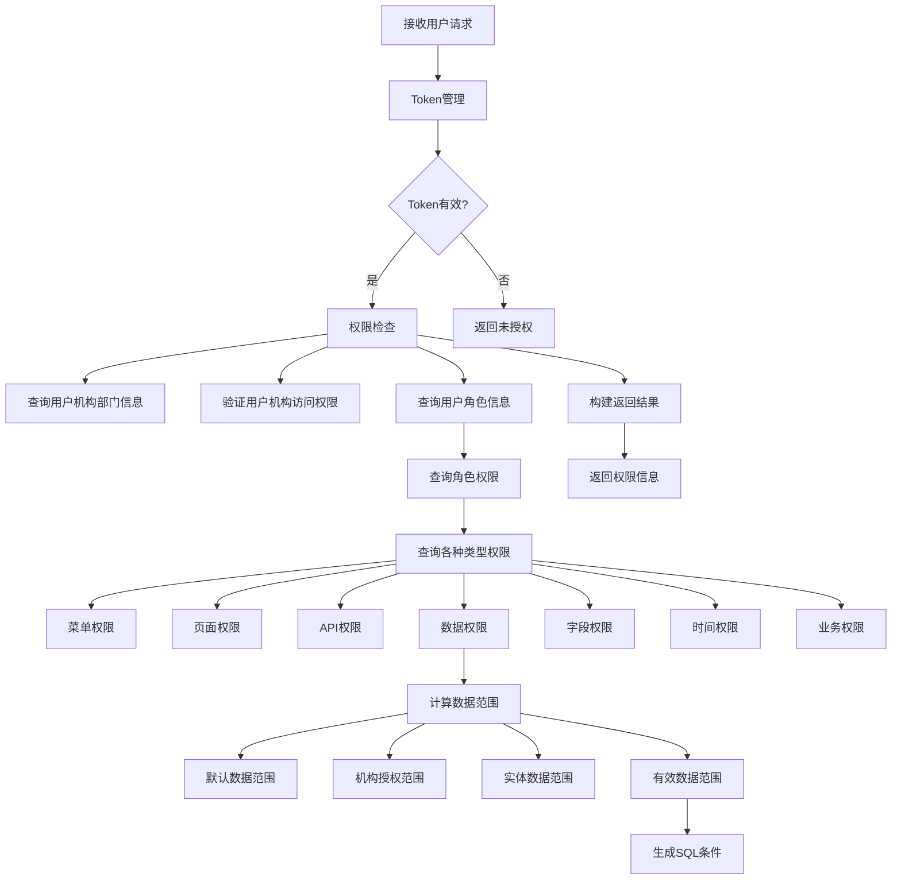

# AuthServiceImpl重构计划

## 1. 业务逻辑梳理与流程图

### 1.1 核心业务逻辑

AuthServiceImpl目前包含以下核心业务逻辑：

1. **Token管理**：
   - 生成访问Token（带或不带机构信息）
   - 生成CSRF Token
   - Token验证与失效处理
   - 从Token中提取用户信息

2. **权限检查**：
   - 查询用户的所有机构部门信息
   - 验证用户在指定机构下的访问权限
   - 计算用户数据范围
   - 查询各种类型的权限（菜单、页面、API、数据、字段、时间、业务）

3. **数据范围计算**：
   - 基于角色默认数据范围
   - 基于机构授权范围
   - 基于实体数据范围
   - 计算实际有效数据范围
   - 生成SQL条件

### 1.2 业务流程图



## 2. 模块划分方案

### 2.1 模块划分原则

1. **单一职责原则**：每个模块只负责一种类型的功能
2. **分层架构原则**：严格按照实体类、Mapper接口、Service接口及实现类分层
3. **高内聚低耦合**：模块内部高度内聚，模块间低耦合
4. **可扩展性**：便于后续功能扩展

### 2.2 具体模块划分

| 模块名称 | 主要职责 | 实现类 |
|---------|---------|--------|
| Token管理模块 | 处理Token的生成、验证和失效 | TokenServiceImpl |
| 权限检查模块 | 验证用户权限，查询各种类型权限 | PermissionCheckServiceImpl |
| 数据范围计算模块 | 计算用户数据范围，生成SQL条件 | DataScopeServiceImpl |
| 用户机构信息模块 | 查询用户的机构和部门信息 | UserOrgDeptServiceImpl |
| 菜单权限模块 | 处理菜单相关权限 | MenuPermissionServiceImpl |
| 页面权限模块 | 处理页面和按钮权限 | PagePermissionServiceImpl |
| API权限模块 | 处理API接口权限 | ApiPermissionServiceImpl |
| 数据权限模块 | 处理数据访问权限 | DataPermissionServiceImpl |
| 字段权限模块 | 处理字段级权限 | FieldPermissionServiceImpl |
| 时间权限模块 | 处理时间相关权限 | TimePermissionServiceImpl |
| 业务权限模块 | 处理业务规则权限 | BusinessPermissionServiceImpl |

## 3. 代码迁移顺序表

| 阶段 | 迁移内容 | 顺序 | 依赖关系 |
|------|---------|------|---------|
| 1 | 定义各模块的Service接口 | 1.1 | 无 |
| 2 | 实现各模块的Service实现类 | 1.2 | 依赖阶段1 |
| 3 | 迁移Token管理相关方法 | 2.1 | 依赖阶段2 |
| 4 | 迁移用户机构信息查询方法 | 2.2 | 依赖阶段2 |
| 5 | 迁移数据范围计算相关方法 | 2.3 | 依赖阶段2 |
| 6 | 迁移权限检查核心方法 | 2.4 | 依赖阶段5 |
| 7 | 迁移各种类型权限查询方法 | 2.5 | 依赖阶段2 |
| 8 | 优化AuthServiceImpl作为入口类 | 3.1 | 依赖阶段6、7 |
| 9 | 添加Javadoc注释 | 3.2 | 依赖阶段8 |
| 10 | 编写单元测试 | 4.1 | 依赖阶段3-8 |

## 4. 测试验证策略

### 4.1 单元测试

| 测试对象 | 测试内容 | 测试方法 |
|---------|---------|---------|
| TokenServiceImpl | Token生成、验证、失效 | JUnit+Mockito |
| DataScopeServiceImpl | 数据范围计算、SQL条件生成 | JUnit+Mockito |
| PermissionCheckServiceImpl | 权限检查逻辑 | JUnit+Mockito |
| UserOrgDeptServiceImpl | 用户机构部门信息查询 | JUnit+Mockito |

### 4.2 集成测试

| 测试对象 | 测试内容 | 测试方法 |
|---------|---------|---------|
| AuthService | 完整权限检查流程 | SpringBootTest |
| 各Service协同 | 模块间调用 | SpringBootTest |
| 数据库交互 | SQL查询准确性 | SpringBootTest+TestContainers |

### 4.3 功能测试

| 测试场景 | 测试内容 | 测试方法 |
|---------|---------|---------|
| Token生成与验证 | 生成有效Token，验证有效性 | 手动测试+Postman |
| 权限检查 | 不同角色用户的权限返回 | 手动测试+Postman |
| 数据范围 | 不同数据范围的SQL条件 | 手动测试+日志验证 |
| 各种权限类型 | 菜单、页面、API等权限查询 | 手动测试+Postman |

### 4.4 性能测试

| 测试内容 | 测试方法 | 预期结果 |
|---------|---------|---------|
| Token生成性能 | JMH基准测试 | 每秒生成10000+ Token |
| 权限检查响应时间 | 压力测试 | 95%请求<100ms |
| 数据库查询优化 | Explain分析 | 无全表扫描 |

## 5. 架构设计与实现

### 5.1 分层架构

```
┌───────────────────────────────────────────────────────────────────┐
│                            Controller层                            │
└───────────────────────────────────────────────────────────────────┘
                                    ▲
                                    │
┌───────────────────────────────────────────────────────────────────┐
│                            Service层                              │
│  ┌─────────────────┐  ┌─────────────────┐  ┌─────────────────┐     │
│  │  AuthService    │  │  TokenService   │  │ PermissionService │  │
│  └─────────────────┘  └─────────────────┘  └─────────────────┘     │
│  ┌─────────────────┐  ┌─────────────────┐  ┌─────────────────┐     │
│  │ DataScopeService│  │ MenuPermissionService │  │ ...           │  │
│  └─────────────────┘  └─────────────────┘  └─────────────────┘     │
└───────────────────────────────────────────────────────────────────┘
                                    ▲
                                    │
┌───────────────────────────────────────────────────────────────────┐
│                            Mapper层                               │
└───────────────────────────────────────────────────────────────────┘
                                    ▲
                                    │
┌───────────────────────────────────────────────────────────────────┐
│                            Entity层                               │
└───────────────────────────────────────────────────────────────────┘
```

### 5.2 核心接口设计

1. **TokenService**：
   - 负责Token的生成、验证和管理

2. **PermissionCheckService**：
   - 负责整体权限检查流程

3. **DataScopeService**：
   - 负责数据范围计算和SQL条件生成

4. **UserOrgDeptService**：
   - 负责用户机构部门信息查询

5. **各种权限Service**：
   - 负责特定类型权限的查询

### 5.3 AuthServiceImpl作为入口类

重构后的AuthServiceImpl将作为入口类，主要负责：
1. 接收并处理传入的userNum和orgCode参数
2. 调用各个模块的Service完成具体业务逻辑
3. 组织并返回结果

## 6. 代码规范与注释

### 6.1 命名规范

- 类名：UpperCamelCase
- 方法名：lowerCamelCase
- 参数名：lowerCamelCase
- 变量名：lowerCamelCase
- 常量名：UPPER_SNAKE_CASE

### 6.2 Javadoc注释规范

```java
/**
 * 方法功能描述
 * @param param1 参数1说明
 * @param param2 参数2说明
 * @return 返回值说明
 * @throws ExceptionType 异常说明
 */
```

### 6.3 代码格式要求

- 缩进：4个空格
- 行宽：120字符
- 方法间空行：2行
- 代码块间空行：1行
- 花括号位置：同一行

## 7. 重构实施计划

### 7.1 阶段1：接口定义

1. 定义TokenService接口
2. 定义PermissionCheckService接口
3. 定义DataScopeService接口
4. 定义UserOrgDeptService接口
5. 定义各种权限Service接口

### 7.2 阶段2：实现类编写

1. 实现TokenServiceImpl
2. 实现PermissionCheckServiceImpl
3. 实现DataScopeServiceImpl
4. 实现UserOrgDeptServiceImpl
5. 实现各种权限ServiceImpl

### 7.3 阶段3：方法迁移

1. 将Token相关方法迁移到TokenServiceImpl
2. 将用户机构信息查询方法迁移到UserOrgDeptServiceImpl
3. 将数据范围计算方法迁移到DataScopeServiceImpl
4. 将权限检查核心方法迁移到PermissionCheckServiceImpl
5. 将各种类型权限查询方法迁移到对应的ServiceImpl

### 7.4 阶段4：优化AuthServiceImpl

1. 保留核心入口方法
2. 注入各Service依赖
3. 重构checkOrgAccess方法，调用各Service
4. 优化getUserAllOrgDeptInfo方法，调用UserOrgDeptService

### 7.5 阶段5：测试验证

1. 编写单元测试
2. 编写集成测试
3. 进行功能测试
4. 进行性能测试
5. 进行兼容性测试

## 8. 风险评估与应对措施

### 8.1 风险评估

| 风险 | 影响 | 可能性 | 应对措施 |
|------|------|--------|---------|
| 权限计算逻辑错误 | 导致用户权限不正确 | 中 | 详细的单元测试和集成测试，代码review |
| 模块间依赖复杂 | 导致系统难以维护 | 中 | 清晰的接口设计，合理的依赖关系 |
| 性能下降 | 影响系统响应时间 | 低 | 性能测试，优化SQL查询，添加缓存 |
| 兼容性问题 | 导致现有功能失效 | 中 | 全面的功能测试，确保迁移前后功能一致 |

### 8.2 应对措施

1. **代码review**：重构过程中进行多次代码review
2. **测试覆盖**：确保测试覆盖率达到80%以上
3. **渐进式迁移**：分阶段迁移，每个阶段验证通过后再进行下一阶段
4. **回滚方案**：保留原始代码备份，出现问题可快速回滚

## 9. 预期成果

1. **代码结构清晰**：各模块职责明确，便于维护和扩展
2. **性能优化**：减少重复查询，优化SQL条件生成
3. **可扩展性增强**：便于添加新的权限类型和业务规则
4. **可读性提高**：详细的注释和清晰的命名
5. **测试完善**：全面的测试用例，确保功能正确性

## 10. 后续优化建议

1. **添加缓存机制**：对频繁查询的权限信息进行缓存
2. **引入权限表达式引擎**：支持更复杂的权限规则
3. **实现权限动态加载**：支持运行时修改权限规则
4. **添加权限审计功能**：记录权限使用情况
5. **优化权限计算算法**：提高复杂场景下的计算效率

通过以上重构计划，我们将实现AuthServiceImpl的系统性优化与架构重构，使其符合分层架构设计规范，提高代码的可维护性、可读性和可扩展性。