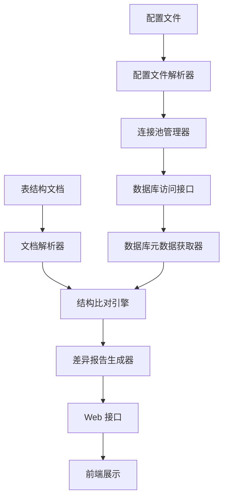

# 多数据库连接与表结构文档校验功能整合方案

## 1. 需求分析

### 1.1 功能概述
- **多数据库连接管理**：支持从配置文件读取多个数据库连接信息，管理连接池，提供统一的数据库访问接口
- **数据库表结构文档校验**：对比文档中的表结构与实际数据库表结构，生成差异报告，支持自动生成修复脚本

### 1.2 目标价值
- 提高系统对多数据库环境的支持能力
- 确保数据库表结构与设计文档的一致性
- 减少人工检查的工作量，提高开发效率
- 为数据库变更提供标准化的管理流程

## 2. 技术架构设计

### 2.1 模块划分
1. **数据库连接管理模块**
   - 配置文件解析器
   - 连接池管理器
   - 数据库访问接口

2. **表结构文档校验模块**
   - 文档解析器
   - 数据库元数据获取器
   - 结构比对引擎
   - 差异报告生成器

3. **Web 接口模块**
   - RESTful API
   - 前端展示组件

### 2.2 核心组件关系


## 3. 实现方案

### 3.1 依赖管理
- 保留现有的 EasyExcel 依赖（3.3.4）
- 添加 Hutool 工具库依赖
- 添加数据库连接池依赖（如 HikariCP）

### 3.2 代码结构

```
src/main/java/com/aiguibin/platform/arch/
├── config/
│   └── DataSourceConfig.java       # 多数据源配置
├── db/
│   ├── connection/                  # 数据库连接管理
│   │   ├── DbConfigParser.java      # 配置文件解析器
│   │   ├── ConnectionPoolManager.java # 连接池管理器
│   │   └── DbAccessor.java          # 数据库访问接口
│   └── validation/                  # 表结构校验
│       ├── DocParser.java           # 文档解析器
│       ├── MetadataFetcher.java     # 元数据获取器
│       ├── StructureComparator.java # 结构比对引擎
│       └── ReportGenerator.java     # 报告生成器
├── controller/
│   └── DbValidationController.java  # Web 接口控制器
├── service/
│   └── DbValidationService.java     # 业务逻辑服务
└── vo/
    ├── DbConfigVo.java              # 数据库配置VO
    └── ValidationResultVo.java      # 校验结果VO
```

### 3.3 关键功能实现

1. **多数据库连接管理**
   - 从 Excel 或 YAML 配置文件读取数据库连接信息
   - 使用 HikariCP 管理多个数据库连接池
   - 提供动态切换数据库的能力

2. **表结构文档校验**
   - 解析 Excel 格式的表结构文档
   - 通过 JDBC 获取数据库元数据
   - 实现表结构比对算法，支持字段名、类型、长度、注释的对比
   - 生成详细的差异报告，包含修复建议和 SQL 脚本

3. **Web 接口**
   - 提供数据库连接管理接口
   - 提供表结构校验触发接口
   - 提供差异报告查询和下载接口

## 4. 整合步骤

### 4.1 准备工作
1. 分析 tcp-config-build-main 项目的核心代码
2. 确定当前项目的集成点
3. 准备必要的依赖包

### 4.2 代码迁移与改造
1. 迁移数据库连接管理相关代码
2. 迁移表结构校验相关代码
3. 适配当前项目的架构和编码规范
4. 整合到 Spring Boot 框架中

### 4.3 测试与验证
1. 测试多数据库连接功能
2. 测试表结构校验功能
3. 测试 Web 接口功能
4. 性能测试与优化

## 5. 风险评估

### 5.1 潜在风险
- 数据库连接管理的安全性
- 表结构比对的准确性
- 大量数据处理时的性能问题
- 不同数据库类型的兼容性

### 5.2 应对策略
- 实现数据库密码加密存储
- 增强表结构比对算法的健壮性
- 优化大数据量处理的内存使用
- 添加数据库类型适配层

## 6. 交付物

1. 需求文档（RD）
2. 详细设计文档（DD）
3. 完整的代码实现
4. 测试报告
5. 用户手册

## 7. 后续优化方向

- 支持更多类型的配置文件格式
- 增强表结构变更的版本管理
- 提供表结构文档的自动生成功能
- 集成到 CI/CD 流程中，实现自动化校验