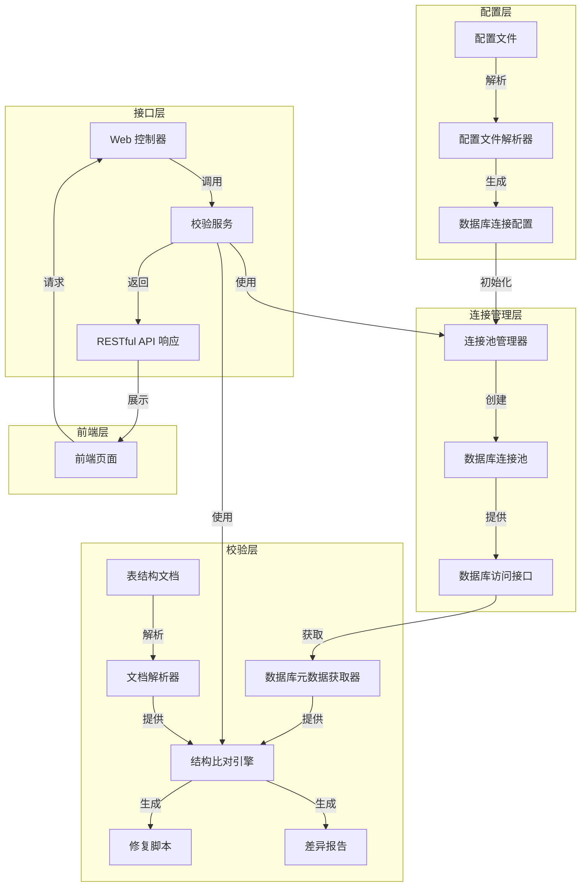

# 多数据库连接与表结构文档校验功能详细设计文档

## 1. 系统架构设计

### 1.1 模块划分

| 模块名称 | 主要职责 | 核心组件 | 文件位置 |
|---------|---------|---------|----------|
| 数据库连接管理模块 | 管理多个数据库连接的配置、创建和释放 | 配置文件解析器、连接池管理器、数据库访问接口 | `src/main/java/com/aiguibin/platform/arch/db/connection/` |
| 表结构文档校验模块 | 解析文档、获取数据库元数据、执行结构比对、生成差异报告 | 文档解析器、元数据获取器、结构比对引擎、报告生成器 | `src/main/java/com/aiguibin/platform/arch/db/validation/` |
| Web 接口模块 | 提供 RESTful API 接口，处理前端请求 | 控制器、服务层接口 | `src/main/java/com/aiguibin/platform/arch/controller/` 和 `src/main/java/com/aiguibin/platform/arch/service/` |
| 数据模型模块 | 定义核心数据结构和 VO 类 | VO 类、枚举类 | `src/main/java/com/aiguibin/platform/arch/vo/` |
| 配置管理模块 | 管理系统配置和数据源配置 | 数据源配置类 | `src/main/java/com/aiguibin/platform/arch/config/` |

### 1.2 核心组件关系



### 1.3 核心流程

**表结构校验流程**：
1. 前端用户选择要校验的数据库连接和表结构文档
2. Web 控制器接收请求并调用校验服务
3. 校验服务通过连接池管理器获取数据库连接
4. 文档解析器解析表结构文档，提取表结构信息
5. 数据库元数据获取器通过数据库连接获取实际表结构信息
6. 结构比对引擎执行表结构比对，生成差异信息
7. 报告生成器生成差异报告和修复脚本
8. 校验服务释放数据库连接
9. Web 控制器返回差异报告给前端

## 2. 技术原理说明

### 2.1 多数据库连接池管理机制

#### 2.1.1 技术选型
- **连接池**：HikariCP（高性能、轻量级连接池）
- **配置管理**：使用 Spring Boot 配置管理机制，支持 YAML 和 Excel 配置文件
- **密码加密**：使用 Spring Security Crypto 模块进行密码加密

#### 2.1.2 实现原理
1. **配置文件解析**：
   - 支持从 Excel 或 YAML 文件读取数据库连接配置
   - 解析配置信息，包括数据库类型、连接参数、连接池参数等
   - 对密码进行解密处理

2. **连接池管理**：
   - 使用 HikariDataSource 作为连接池实现
   - 为每个数据库连接创建独立的连接池
   - 实现连接池的动态创建和销毁
   - 提供连接池状态监控和健康检查

3. **动态连接切换**：
   - 在执行表结构校验时，根据配置动态获取数据库连接
   - 连接使用完毕后，通过 try-with-resources 自动释放
   - 确保不影响现有系统的数据库连接

4. **无侵入性设计**：
   - **独立配置空间**：使用专门的配置文件和路径存储外部数据库连接信息，不与系统现有配置冲突
   - **隔离的连接池**：为外部数据库创建完全独立的连接池，与系统默认连接池分离
   - **按需创建**：仅在执行表结构校验时创建连接，校验完成后立即销毁连接池
   - **资源管理**：使用 try-with-resources 确保所有连接资源及时释放
   - **线程隔离**：校验操作在独立线程中执行，不影响系统主线程的数据库操作

5. **安全性保障**：
   - 密码加密存储，不在内存中明文保存
   - 连接信息仅在校验过程中临时使用
   - 校验完成后清除所有敏感信息

### 2.2 数据库元数据获取与解析方案

#### 2.2.1 技术选型
- **JDBC 元数据 API**：使用 java.sql.DatabaseMetaData 接口获取数据库元数据
- **多数据库适配**：通过策略模式适配不同数据库类型的元数据获取方式

#### 2.2.2 实现原理
1. **元数据获取**：
   - 使用 Connection.getMetaData() 获取数据库元数据
   - 通过元数据 API 获取表信息、列信息、索引信息、约束信息

2. **多数据库适配**：
   - 为不同数据库类型（MySQL、Oracle、PostgreSQL 等）实现专用的元数据获取策略
   - 使用工厂模式创建对应数据库类型的元数据获取器

3. **数据缓存**：
   - 缓存获取的元数据信息，减少数据库访问次数
   - 在校验完成后清理缓存，释放内存

### 2.3 表结构文档与实际表结构比对算法

#### 2.3.1 技术选型
- **文档解析**：使用 EasyExcel 解析 Excel 格式的表结构文档
- **比对算法**：使用哈希表和集合操作实现高效比对

#### 2.3.2 实现原理
1. **文档解析**：
   - 解析 Excel 文件中的表结构信息，包括表名、字段名、字段类型、字段长度、字段注释等
   - 将解析结果转换为标准化的表结构对象

2. **比对策略**：
   - **表级比对**：
     - 检查文档中定义的表是否存在于数据库中
     - 检查数据库中是否存在文档中未定义的表
   
   - **字段级比对**：
     - 检查字段名的一致性
     - 检查字段类型的一致性
     - 检查字段长度的一致性
     - 检查字段注释的一致性
   
   - **索引比对**：
     - 检查索引的定义与实际存在情况
     - 检查索引列的一致性
   
   - **约束比对**：
     - 检查主键、外键、唯一性约束等的一致性

3. **差异分析**：
   - 生成详细的差异信息，包括缺失项、不一致项等
   - 为每个差异项生成对应的修复建议和 SQL 脚本

4. **性能优化**：
   - 使用哈希表存储表结构信息，提高比对效率
   - 批量处理表结构信息，减少内存使用
   - 并行处理多个表的比对，提高处理速度

## 3. 数据模型设计

### 3.1 核心数据结构

#### 3.1.1 数据库连接配置

```java
public class DbConfig {
    private String id;              // 连接配置ID
    private String name;            // 连接名称
    private String dbType;          // 数据库类型
    private String host;            // 主机地址
    private String port;            // 端口
    private String database;        // 数据库名称
    private String username;        // 用户名
    private String password;        // 密码（加密存储）
    private int maxPoolSize;        // 最大连接数
    private int minIdle;            // 最小空闲连接数
    private long maxLifetime;       // 连接最大生命周期
    private long connectionTimeout; // 连接超时时间
    private boolean enabled;        // 是否启用
}
```

#### 3.1.2 表结构信息

```java
public class TableStructure {
    private String tableName;               // 表名
    private String tableComment;            // 表注释
    private List<ColumnStructure> columns;  // 字段列表
    private List<IndexStructure> indexes;   // 索引列表
    private List<ConstraintStructure> constraints; // 约束列表
}

public class ColumnStructure {
    private String columnName;    // 字段名
    private String columnType;    // 字段类型
    private int columnLength;     // 字段长度
    private String columnComment; // 字段注释
    private boolean nullable;     // 是否可为空
    private String defaultValue;  // 默认值
}

public class IndexStructure {
    private String indexName;     // 索引名
    private List<String> columns; // 索引列
    private boolean unique;       // 是否唯一索引
}

public class ConstraintStructure {
    private String constraintName; // 约束名
    private String constraintType; // 约束类型
    private List<String> columns;  // 约束列
    private String referencedTable; // 引用表（外键约束）
    private List<String> referencedColumns; // 引用列（外键约束）
}
```

#### 3.1.3 差异信息

```java
public class DiffInfo {
    private String diffType;        // 差异类型
    private String tableName;       // 表名
    private String columnName;      // 字段名（可选）
    private String docValue;        // 文档中的值
    private String dbValue;         // 数据库中的值
    private String description;     // 差异描述
    private String fixScript;       // 修复脚本
}

public enum DiffType {
    TABLE_MISSING,        // 表缺失
    TABLE_EXTRA,          // 表多余
    COLUMN_MISSING,       // 字段缺失
    COLUMN_EXTRA,         // 字段多余
    COLUMN_TYPE_MISMATCH, // 字段类型不匹配
    COLUMN_LENGTH_MISMATCH, // 字段长度不匹配
    COLUMN_COMMENT_MISMATCH, // 字段注释不匹配
    INDEX_MISSING,        // 索引缺失
    INDEX_EXTRA,          // 索引多余
    CONSTRAINT_MISSING,   // 约束缺失
    CONSTRAINT_EXTRA      // 约束多余
}
```

#### 3.1.4 校验结果

```java
public class ValidationResult {
    private String validationId;     // 校验任务ID
    private String dbConfigId;       // 数据库配置ID
    private String dbName;           // 数据库名称
    private String documentName;     // 文档名称
    private LocalDateTime startTime; // 开始时间
    private LocalDateTime endTime;   // 结束时间
    private boolean success;         // 是否成功
    private String errorMessage;     // 错误信息
    private int totalTables;         // 总表数
    private int diffCount;           // 差异数
    private List<DiffInfo> diffs;     // 差异列表
    private String reportUrl;        // 报告URL
    private String fixScriptUrl;     // 修复脚本URL
}
```

### 3.2 数据库表结构

#### 3.2.1 数据库连接配置表（db_connection_config）

| 字段名 | 数据类型 | 长度 | 约束 | 描述 |
|-------|---------|------|------|------|
| id | VARCHAR | 36 | PRIMARY KEY | 连接配置ID |
| name | VARCHAR | 100 | NOT NULL | 连接名称 |
| db_type | VARCHAR | 50 | NOT NULL | 数据库类型 |
| host | VARCHAR | 255 | NOT NULL | 主机地址 |
| port | VARCHAR | 10 | NOT NULL | 端口 |
| database | VARCHAR | 100 | NOT NULL | 数据库名称 |
| username | VARCHAR | 100 | NOT NULL | 用户名 |
| password | VARCHAR | 255 | NOT NULL | 加密后的密码 |
| max_pool_size | INT | 10 | DEFAULT 10 | 最大连接数 |
| min_idle | INT | 10 | DEFAULT 5 | 最小空闲连接数 |
| max_lifetime | BIGINT | 20 | DEFAULT 1800000 | 连接最大生命周期（毫秒） |
| connection_timeout | BIGINT | 20 | DEFAULT 30000 | 连接超时时间（毫秒） |
| enabled | BOOLEAN | 1 | DEFAULT TRUE | 是否启用 |
| create_time | DATETIME | - | DEFAULT CURRENT_TIMESTAMP | 创建时间 |
| update_time | DATETIME | - | DEFAULT CURRENT_TIMESTAMP ON UPDATE CURRENT_TIMESTAMP | 更新时间 |

#### 3.2.2 校验任务记录表（validation_task）

| 字段名 | 数据类型 | 长度 | 约束 | 描述 |
|-------|---------|------|------|------|
| id | VARCHAR | 36 | PRIMARY KEY | 校验任务ID |
| db_config_id | VARCHAR | 36 | NOT NULL | 数据库配置ID |
| db_name | VARCHAR | 100 | NOT NULL | 数据库名称 |
| document_name | VARCHAR | 255 | NOT NULL | 文档名称 |
| start_time | DATETIME | - | NOT NULL | 开始时间 |
| end_time | DATETIME | - | NULL | 结束时间 |
| success | BOOLEAN | 1 | NOT NULL | 是否成功 |
| error_message | TEXT | - | NULL | 错误信息 |
| total_tables | INT | 10 | DEFAULT 0 | 总表数 |
| diff_count | INT | 10 | DEFAULT 0 | 差异数 |
| report_url | VARCHAR | 255 | NULL | 报告URL |
| fix_script_url | VARCHAR | 255 | NULL | 修复脚本URL |
| create_time | DATETIME | - | DEFAULT CURRENT_TIMESTAMP | 创建时间 |

## 4. 接口设计

### 4.1 API 规范

| 接口类型 | URL 路径 | 方法 | 模块 | 功能描述 |
|---------|---------|------|------|----------|
| 数据库连接管理 | /api/db/config | GET | 连接管理 | 获取数据库连接配置列表 |
| 数据库连接管理 | /api/db/config | POST | 连接管理 | 创建数据库连接配置 |
| 数据库连接管理 | /api/db/config/{id} | PUT | 连接管理 | 更新数据库连接配置 |
| 数据库连接管理 | /api/db/config/{id} | DELETE | 连接管理 | 删除数据库连接配置 |
| 数据库连接管理 | /api/db/config/{id}/test | POST | 连接管理 | 测试数据库连接 |
| 表结构校验 | /api/db/validation | POST | 校验管理 | 执行表结构校验 |
| 表结构校验 | /api/db/validation/{id} | GET | 校验管理 | 获取校验任务详情 |
| 表结构校验 | /api/db/validation | GET | 校验管理 | 获取校验任务列表 |
| 表结构校验 | /api/db/validation/{id}/report | GET | 校验管理 | 获取差异报告 |
| 表结构校验 | /api/db/validation/{id}/fix-script | GET | 校验管理 | 获取修复脚本 |
| 文档管理 | /api/db/document | POST | 文档管理 | 上传表结构文档 |
| 文档管理 | /api/db/document | GET | 文档管理 | 获取文档列表 |
| 文档管理 | /api/db/document/{id} | DELETE | 文档管理 | 删除文档 |

### 4.2 核心接口参数说明

#### 4.2.1 创建数据库连接配置

**请求路径**：`/api/db/config`
**请求方法**：POST
**请求体**：
```json
{
  "name": "测试数据库",
  "dbType": "mysql",
  "host": "localhost",
  "port": "3306",
  "database": "test_db",
  "username": "root",
  "password": "123456",
  "maxPoolSize": 10,
  "minIdle": 5,
  "maxLifetime": 1800000,
  "connectionTimeout": 30000,
  "enabled": true
}
```

**响应**：
```json
{
  "code": 200,
  "message": "success",
  "data": {
    "id": "1",
    "name": "测试数据库",
    "dbType": "mysql",
    "host": "localhost",
    "port": "3306",
    "database": "test_db",
    "username": "root",
    "maxPoolSize": 10,
    "minIdle": 5,
    "maxLifetime": 1800000,
    "connectionTimeout": 30000,
    "enabled": true,
    "createTime": "2023-12-25T10:00:00"
  }
}
```

#### 4.2.2 执行表结构校验

**请求路径**：`/api/db/validation`
**请求方法**：POST
**请求体**：
```json
{
  "dbConfigId": "1",
  "documentId": "2",
  "tables": ["user", "order"] // 可选，指定要校验的表，不指定则校验所有表
}
```

**响应**：
```json
{
  "code": 200,
  "message": "success",
  "data": {
    "validationId": "1",
    "dbConfigId": "1",
    "dbName": "test_db",
    "documentName": "表结构设计文档.xlsx",
    "startTime": "2023-12-25T10:00:00",
    "endTime": "2023-12-25T10:00:30",
    "success": true,
    "totalTables": 2,
    "diffCount": 1,
    "reportUrl": "/api/db/validation/1/report",
    "fixScriptUrl": "/api/db/validation/1/fix-script"
  }
}
```

#### 4.2.3 获取差异报告

**请求路径**：`/api/db/validation/{id}/report`
**请求方法**：GET
**响应**：
```json
{
  "code": 200,
  "message": "success",
  "data": {
    "validationId": "1",
    "dbName": "test_db",
    "documentName": "表结构设计文档.xlsx",
    "validationTime": "2023-12-25T10:00:30",
    "totalTables": 2,
    "diffCount": 1,
    "diffs": [
      {
        "diffType": "COLUMN_MISSING",
        "tableName": "user",
        "columnName": "email",
        "docValue": "VARCHAR(255) COMMENT '邮箱'",
        "dbValue": "不存在",
        "description": "数据库表缺少email字段",
        "fixScript": "ALTER TABLE user ADD COLUMN email VARCHAR(255) DEFAULT NULL COMMENT '邮箱';"
      }
    ]
  }
}
```

## 5. 伪代码实现

### 5.1 数据库连接管理模块

#### 5.1.1 配置文件解析器

```java
public class DbConfigParser {
    // 解析 Excel 配置文件
    public List<DbConfig> parseExcel(File file) {
        // 1. 使用 EasyExcel 读取 Excel 文件
        // 2. 遍历每行数据，转换为 DbConfig 对象
        // 3. 对密码进行加密处理
        // 4. 返回 DbConfig 列表
    }

    // 解析 YAML 配置文件
    public List<DbConfig> parseYaml(File file) {
        // 1. 读取 YAML 文件
        // 2. 解析 YAML 结构，转换为 DbConfig 对象
        // 3. 对密码进行加密处理
        // 4. 返回 DbConfig 列表
    }

    // 测试数据库连接
    public boolean testConnection(DbConfig config) {
        // 1. 根据配置创建数据库连接
        // 2. 尝试执行简单查询
        // 3. 关闭连接
        // 4. 返回连接是否成功
    }
}
```

#### 5.1.2 连接池管理器

```java
public class ConnectionPoolManager {
    private Map<String, HikariDataSource> dataSources = new ConcurrentHashMap<>();

    // 根据配置创建连接池
    public synchronized HikariDataSource createDataSource(DbConfig config) {
        // 1. 检查是否已存在对应连接池
        // 2. 创建 HikariDataSource 实例
        // 3. 设置连接池参数
        // 4. 初始化连接池
        // 5. 存储到 dataSources 映射中
        // 6. 返回数据源
    }

    // 获取数据库连接
    public Connection getConnection(String configId) {
        // 1. 根据 configId 获取对应数据源
        // 2. 从数据源获取连接
        // 3. 返回连接
    }

    // 释放连接池
    public synchronized void releaseDataSource(String configId) {
        // 1. 根据 configId 获取对应数据源
        // 2. 关闭数据源
        // 3. 从 dataSources 映射中移除
    }

    // 测试连接池状态
    public boolean testDataSource(String configId) {
        // 1. 根据 configId 获取对应数据源
        // 2. 测试数据源连接
        // 3. 返回测试结果
    }
}
```

#### 5.1.3 数据库访问接口

```java
public class DbAccessor {
    private ConnectionPoolManager poolManager;

    // 构造函数
    public DbAccessor(ConnectionPoolManager poolManager) {
        this.poolManager = poolManager;
    }

    // 执行查询
    public List<Map<String, Object>> query(String configId, String sql, Object... params) {
        // 1. 获取数据库连接
        // 2. 创建 PreparedStatement
        // 3. 设置参数
        // 4. 执行查询
        // 5. 处理结果集
        // 6. 关闭资源
        // 7. 返回结果列表
    }

    // 执行更新
    public int update(String configId, String sql, Object... params) {
        // 1. 获取数据库连接
        // 2. 创建 PreparedStatement
        // 3. 设置参数
        // 4. 执行更新
        // 5. 关闭资源
        // 6. 返回影响行数
    }

    // 执行批量更新
    public int[] batchUpdate(String configId, String sql, List<Object[]> paramsList) {
        // 1. 获取数据库连接
        // 2. 创建 PreparedStatement
        // 3. 批量设置参数
        // 4. 执行批量更新
        // 5. 关闭资源
        // 6. 返回影响行数数组
    }
}
```

### 5.2 表结构文档解析模块

#### 5.2.1 文档解析器

```java
public class DocParser {
    // 解析 Excel 格式的表结构文档
    public Map<String, TableStructure> parseExcel(File file) {
        // 1. 使用 EasyExcel 读取 Excel 文件
        // 2. 解析目录 sheet，获取所有表名
        // 3. 遍历每个表对应的 sheet
        // 4. 解析表结构信息，包括字段、索引、约束
        // 5. 构建 TableStructure 对象
        // 6. 返回表结构映射
    }

    // 解析单个表的结构
    private TableStructure parseTableSheet(Sheet sheet) {
        // 1. 解析表名和表注释
        // 2. 解析字段信息
        // 3. 解析索引信息
        // 4. 解析约束信息
        // 5. 构建并返回 TableStructure 对象
    }

    // 解析字段信息
    private List<ColumnStructure> parseColumns(Row row) {
        // 1. 遍历行数据
        // 2. 提取字段名、字段类型、字段长度、字段注释等信息
        // 3. 构建 ColumnStructure 对象
        // 4. 返回字段列表
    }
}
```

### 5.3 结构比对与差异报告生成模块

#### 5.3.1 数据库元数据获取器

```java
public class MetadataFetcher {
    private DbAccessor dbAccessor;

    // 构造函数
    public MetadataFetcher(DbAccessor dbAccessor) {
        this.dbAccessor = dbAccessor;
    }

    // 获取数据库所有表结构
    public Map<String, TableStructure> getTableStructures(String configId, String database) {
        // 1. 获取数据库连接
        // 2. 获取数据库元数据
        // 3. 获取所有表名
        // 4. 遍历每个表，获取表结构信息
        // 5. 构建 TableStructure 对象
        // 6. 返回表结构映射
    }

    // 获取单个表的结构
    private TableStructure getTableStructure(Connection conn, String database, String tableName) {
        // 1. 获取表注释
        // 2. 获取字段信息
        // 3. 获取索引信息
        // 4. 获取约束信息
        // 5. 构建并返回 TableStructure 对象
    }

    // 获取字段信息
    private List<ColumnStructure> getColumns(Connection conn, String database, String tableName) {
        // 1. 使用 DatabaseMetaData 获取字段信息
        // 2. 遍历结果集，提取字段属性
        // 3. 构建 ColumnStructure 对象
        // 4. 返回字段列表
    }
}
```

#### 5.3.2 结构比对引擎

```java
public class StructureComparator {
    // 比对表结构
    public List<DiffInfo> compare(Map<String, TableStructure> docStructures, Map<String, TableStructure> dbStructures) {
        List<DiffInfo> diffs = new ArrayList<>();
        
        // 1. 比对表级差异
        compareTables(docStructures, dbStructures, diffs);
        
        // 2. 比对字段级差异
        compareColumns(docStructures, dbStructures, diffs);
        
        // 3. 比对索引级差异
        compareIndexes(docStructures, dbStructures, diffs);
        
        // 4. 比对约束级差异
        compareConstraints(docStructures, dbStructures, diffs);
        
        return diffs;
    }

    // 比对表级差异
    private void compareTables(Map<String, TableStructure> docStructures, Map<String, TableStructure> dbStructures, List<DiffInfo> diffs) {
        // 1. 检查文档中的表是否在数据库中存在
        // 2. 检查数据库中的表是否在文档中存在
        // 3. 生成差异信息
    }

    // 比对字段级差异
    private void compareColumns(Map<String, TableStructure> docStructures, Map<String, TableStructure> dbStructures, List<DiffInfo> diffs) {
        // 1. 遍历文档中的每个表
        // 2. 检查数据库中是否存在该表
        // 3. 比对字段名、类型、长度、注释等
        // 4. 生成差异信息
    }

    // 生成修复脚本
    private String generateFixScript(DiffInfo diff) {
        // 根据差异类型生成对应的 SQL 修复脚本
    }
}
```

#### 5.3.3 报告生成器

```java
public class ReportGenerator {
    // 生成差异报告
    public ValidationResult generateReport(String validationId, String dbName, String documentName, List<DiffInfo> diffs) {
        // 1. 构建 ValidationResult 对象
        // 2. 设置基本信息
        // 3. 添加差异列表
        // 4. 生成报告文件
        // 5. 生成修复脚本文件
        // 6. 设置报告和脚本的 URL
        // 7. 返回 ValidationResult 对象
    }

    // 生成 Excel 格式报告
    public File generateExcelReport(List<DiffInfo> diffs) {
        // 1. 创建 Excel 文件
        // 2. 写入差异信息
        // 3. 设置样式
        // 4. 返回 Excel 文件
    }

    // 生成 HTML 格式报告
    public File generateHtmlReport(List<DiffInfo> diffs) {
        // 1. 创建 HTML 文件
        // 2. 写入差异信息
        // 3. 设置样式
        // 4. 返回 HTML 文件
    }

    // 生成修复脚本
    public File generateFixScript(List<DiffInfo> diffs) {
        // 1. 创建 SQL 文件
        // 2. 写入修复脚本
        // 3. 返回 SQL 文件
    }
}
```

## 6. 异常处理策略

### 6.1 异常类型

| 异常类型 | 描述 | 处理策略 |
|---------|------|----------|
| DbConfigException | 数据库配置异常 | 记录错误日志，返回 400 错误码和详细错误信息 |
| ConnectionException | 数据库连接异常 | 记录错误日志，返回 500 错误码和连接失败信息 |
| DocParseException | 文档解析异常 | 记录错误日志，返回 400 错误码和文档格式错误信息 |
| ValidationException | 校验执行异常 | 记录错误日志，返回 500 错误码和校验失败信息 |
| FileUploadException | 文件上传异常 | 记录错误日志，返回 400 错误码和文件上传错误信息 |
| UnauthorizedException | 未授权访问 | 记录错误日志，返回 401 错误码和未授权信息 |
| ForbiddenException | 禁止访问 | 记录错误日志，返回 403 错误码和禁止访问信息 |

### 6.2 全局异常处理器

```java
@RestControllerAdvice
public class GlobalExceptionHandler {
    @ExceptionHandler(DbConfigException.class)
    public ResponseEntity<ApiResponse> handleDbConfigException(DbConfigException e) {
        // 1. 记录错误日志
        // 2. 构建错误响应
        // 3. 返回 400 错误码
    }

    @ExceptionHandler(ConnectionException.class)
    public ResponseEntity<ApiResponse> handleConnectionException(ConnectionException e) {
        // 1. 记录错误日志
        // 2. 构建错误响应
        // 3. 返回 500 错误码
    }

    @ExceptionHandler(DocParseException.class)
    public ResponseEntity<ApiResponse> handleDocParseException(DocParseException e) {
        // 1. 记录错误日志
        // 2. 构建错误响应
        // 3. 返回 400 错误码
    }

    @ExceptionHandler(ValidationException.class)
    public ResponseEntity<ApiResponse> handleValidationException(ValidationException e) {
        // 1. 记录错误日志
        // 2. 构建错误响应
        // 3. 返回 500 错误码
    }

    @ExceptionHandler(Exception.class)
    public ResponseEntity<ApiResponse> handleException(Exception e) {
        // 1. 记录错误日志
        // 2. 构建错误响应
        // 3. 返回 500 错误码
    }
}
```

## 7. 测试策略与用例设计

### 7.1 测试策略

1. **单元测试**：
   - 测试各个模块的核心功能，如配置文件解析、连接池管理、文档解析、结构比对等
   - 使用 Mock 对象模拟外部依赖，如数据库连接、文件系统等

2. **集成测试**：
   - 测试模块间的交互，如连接管理模块与校验模块的集成
   - 测试完整的校验流程，从配置读取到报告生成

3. **系统测试**：
   - 测试整个系统的功能，包括 Web 接口、前端交互等
   - 测试不同数据库类型的兼容性

4. **性能测试**：
   - 测试系统在处理大量表结构时的性能
   - 测试并发执行校验任务时的系统稳定性

5. **安全测试**：
   - 测试密码加密存储的安全性
   - 测试权限控制的有效性
   - 测试 SQL 注入防护措施

### 7.2 测试用例设计

#### 7.2.1 数据库连接管理测试

| 测试用例名称 | 测试步骤 | 预期结果 |
|------------|---------|----------|
| 解析 Excel 配置文件 | 1. 创建包含多个数据库连接配置的 Excel 文件<br>2. 调用配置文件解析器解析文件<br>3. 验证解析结果 | 成功解析配置文件，返回正确的 DbConfig 列表 |
| 解析 YAML 配置文件 | 1. 创建包含多个数据库连接配置的 YAML 文件<br>2. 调用配置文件解析器解析文件<br>3. 验证解析结果 | 成功解析配置文件，返回正确的 DbConfig 列表 |
| 测试数据库连接 | 1. 创建有效的数据库连接配置<br>2. 调用测试连接方法<br>3. 验证连接结果 | 成功连接到数据库，返回 true |
| 测试无效数据库连接 | 1. 创建无效的数据库连接配置（如错误的密码）<br>2. 调用测试连接方法<br>3. 验证连接结果 | 连接失败，返回 false 并抛出适当的异常 |
| 连接池管理 | 1. 创建数据库连接配置<br>2. 创建连接池<br>3. 获取连接<br>4. 释放连接池<br>5. 验证连接池状态 | 成功创建和释放连接池，连接正常获取和使用 |

#### 7.2.2 表结构文档校验测试

| 测试用例名称 | 测试步骤 | 预期结果 |
|------------|---------|----------|
| 解析表结构文档 | 1. 创建包含表结构信息的 Excel 文档<br>2. 调用文档解析器解析文档<br>3. 验证解析结果 | 成功解析文档，返回正确的 TableStructure 映射 |
| 获取数据库元数据 | 1. 连接到测试数据库<br>2. 调用元数据获取器获取表结构<br>3. 验证获取结果 | 成功获取数据库表结构，返回正确的 TableStructure 映射 |
| 表级比对 | 1. 创建包含不同表的文档和数据库<br>2. 调用结构比对引擎执行比对<br>3. 验证比对结果 | 成功识别表级差异，生成正确的差异信息 |
| 字段级比对 | 1. 创建包含不同字段的文档和数据库表<br>2. 调用结构比对引擎执行比对<br>3. 验证比对结果 | 成功识别字段级差异，生成正确的差异信息 |
| 生成差异报告 | 1. 执行表结构校验，生成差异信息<br>2. 调用报告生成器生成报告<br>3. 验证报告内容 | 成功生成差异报告，包含完整的差异信息 |
| 生成修复脚本 | 1. 执行表结构校验，生成差异信息<br>2. 调用报告生成器生成修复脚本<br>3. 验证脚本内容 | 成功生成修复脚本，包含正确的 SQL 语句 |

#### 7.2.3 Web 接口测试

| 测试用例名称 | 测试步骤 | 预期结果 |
|------------|---------|----------|
| 创建数据库连接配置 | 1. 发送 POST 请求创建数据库连接配置<br>2. 验证响应结果<br>3. 验证配置是否保存成功 | 成功创建数据库连接配置，返回 200 状态码和配置信息 |
| 执行表结构校验 | 1. 上传表结构文档<br>2. 发送 POST 请求执行表结构校验<br>3. 验证响应结果<br>4. 验证校验任务是否创建成功 | 成功执行表结构校验，返回 200 状态码和校验任务信息 |
| 获取差异报告 | 1. 执行表结构校验<br>2. 发送 GET 请求获取差异报告<br>3. 验证响应结果<br>4. 验证报告内容是否正确 | 成功获取差异报告，返回 200 状态码和完整的差异信息 |
| 获取修复脚本 | 1. 执行表结构校验<br>2. 发送 GET 请求获取修复脚本<br>3. 验证响应结果<br>4. 验证脚本内容是否正确 | 成功获取修复脚本，返回 200 状态码和正确的 SQL 语句 |

## 8. 部署与集成方案

### 8.1 依赖管理

| 依赖名称 | 版本 | 用途 | 配置文件 |
|---------|------|------|----------|
| Spring Boot | 2.7.18 | 基础框架 | pom.xml |
| HikariCP | 4.0.3 | 数据库连接池 | pom.xml |
| EasyExcel | 3.3.4 | Excel 文档解析 | pom.xml |
| Hutool | 5.8.25 | 工具库 | pom.xml |
| Spring Security Crypto | 5.7.8 | 密码加密 | pom.xml |
| MyBatis-Plus | 3.5.6 | ORM 框架 | pom.xml |
| MySQL Connector | 8.0.33 | MySQL 驱动 | pom.xml |
| PostgreSQL Driver | 42.6.0 | PostgreSQL 驱动 | pom.xml |
| Oracle Driver | 19.18.0.0 | Oracle 驱动 | pom.xml |

### 8.2 配置文件

#### 8.2.1 应用配置（application.yml）

```yaml
spring:
  datasource:
    # 现有系统数据源配置
    url: jdbc:mysql://localhost:3306/existing_db
    username: root
    password: password
    driver-class-name: com.mysql.cj.jdbc.Driver

# 多数据库连接配置
multi-db:
  config-path: classpath:db-config/
  encrypt-key: your-encrypt-key
  connection-timeout: 30000
  max-lifetime: 1800000
  max-pool-size: 10
  min-idle: 5

# 文件存储配置
file:
  upload-path: /path/to/upload/
  max-size: 104857600

# 日志配置
logging:
  level:
    com.aiguibin.platform.arch.db: info
```

#### 8.2.2 数据库连接配置（db-config.yml）

```yaml
db-configs:
  - id: mysql-test
    name: MySQL 测试库
    db-type: mysql
    host: localhost
    port: 3306
    database: test_db
    username: root
    password: encrypted-password
    max-pool-size: 10
    min-idle: 5
    enabled: true
  
  - id: oracle-test
    name: Oracle 测试库
    db-type: oracle
    host: localhost
    port: 1521
    database: ORCL
    username: system
    password: encrypted-password
    max-pool-size: 10
    min-idle: 5
    enabled: true
```

### 8.3 集成步骤

1. **添加依赖**：
   - 在 pom.xml 中添加必要的依赖包

2. **创建目录结构**：
   - 创建各个模块的目录结构

3. **实现核心功能**：
   - 实现数据库连接管理模块
   - 实现表结构文档校验模块
   - 实现 Web 接口模块
   - 实现数据模型模块

4. **配置系统**：
   - 添加系统配置文件
   - 配置数据源和连接池参数

5. **部署应用**：
   - 构建应用包
   - 部署到服务器
   - 启动应用

6. **测试验证**：
   - 执行测试用例
   - 验证系统功能
   - 优化系统性能

## 9. 监控与维护

### 9.1 监控指标

| 指标名称 | 描述 | 监控方式 |
|---------|------|----------|
| 连接池状态 | 连接池的活跃连接数、空闲连接数、最大连接数等 | 使用 Spring Boot Actuator 暴露指标 |
| 校验任务执行时间 | 执行表结构校验的耗时 | 记录任务执行日志，统计执行时间 |
| 校验任务成功率 | 表结构校验任务的成功比例 | 统计任务执行结果，计算成功率 |
| 差异数量 | 表结构差异的数量 | 统计差异报告中的差异数 |
| 系统内存使用 | 系统运行时的内存使用情况 | 使用 Spring Boot Actuator 暴露指标 |
| 系统 CPU 使用 | 系统运行时的 CPU 使用情况 | 使用 Spring Boot Actuator 暴露指标 |

### 9.2 日志管理

| 日志级别 | 描述 | 使用场景 |
|---------|------|----------|
| DEBUG | 详细的调试信息 | 开发和测试环境 |
| INFO | 一般的信息性消息 | 生产环境的正常操作 |
| WARN | 警告信息 | 潜在的问题，需要关注 |
| ERROR | 错误信息 | 严重的问题，需要立即处理 |

### 9.3 维护策略

1. **定期清理**：
   - 定期清理临时文件，如上传的文档、生成的报告等
   - 定期清理校验任务历史记录，只保留最近的记录

2. **备份策略**：
   - 定期备份数据库连接配置
   - 定期备份校验任务历史记录

3. **升级策略**：
   - 定期升级依赖包，修复安全漏洞
   - 定期更新数据库驱动，支持新的数据库版本

4. **故障处理**：
   - 建立故障处理流程，明确责任人和处理步骤
   - 定期进行故障演练，提高系统的容错能力

## 10. 总结与展望

### 10.1 设计总结

本设计文档详细描述了多数据库连接与表结构文档校验功能的实现方案，包括系统架构设计、技术原理说明、数据模型设计、接口设计和伪代码实现等内容。该设计具有以下特点：

1. **无侵入性**：不影响现有数据库连接，仅在执行检查时动态指定其他数据库连接
2. **高性能**：使用 HikariCP 连接池管理数据库连接，提高连接效率
3. **可扩展性**：采用模块化设计，支持新增数据库类型和校验规则
4. **安全性**：实现密码加密存储，防止敏感信息泄露
5. **易用性**：提供直观的 Web 接口，方便用户操作

### 10.2 未来展望

1. **功能扩展**：
   - 支持更多类型的表结构文档格式，如 Word、Markdown 等
   - 支持数据库版本管理，跟踪表结构的变更历史
   - 支持自动执行修复脚本，实现表结构的自动同步

2. **性能优化**：
   - 引入缓存机制，提高文档解析和结构比对的速度
   - 采用分布式架构，支持大规模数据库的表结构校验

3. **智能化**：
   - 引入机器学习算法，自动识别表结构设计中的潜在问题
   - 提供表结构设计的最佳实践建议

4. **集成扩展**：
   - 集成到 CI/CD 流程中，实现自动化的表结构校验
   - 与版本控制系统集成，跟踪表结构变更与代码变更的关联

通过本设计的实现，系统将具备强大的多数据库连接管理和表结构文档校验能力，为开发和运维人员提供更加便捷、高效的数据库管理工具，确保数据库表结构与设计文档的一致性，提高系统的稳定性和可靠性。