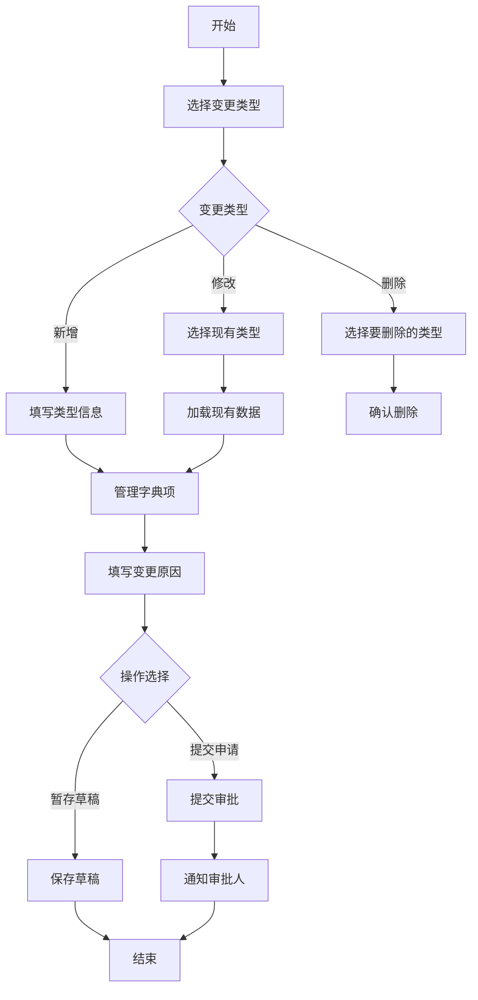
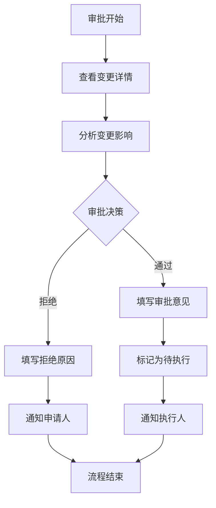
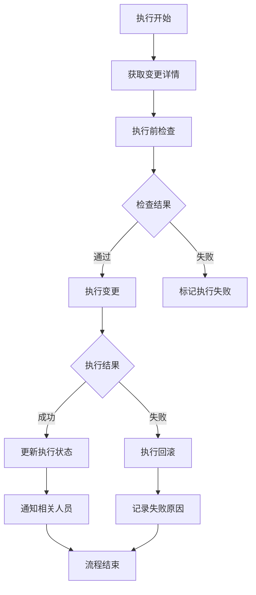

## 原始需求
- 系统中有业务数据字典表biz_ddct_item、biz_ddct_type，需要日常团队不同的人进行变更，变更涉及增删改
- 需求是让开发填写变更表，之后提交存一个记录，不是流程记录，是变更记录
- 审批人员能看见原始的与要变更的，在同一个页面，方便审核
- 前端页面如何设计举例说明，后端逻辑怎么设计，包含哪些API,以及数据库表有哪些，怎么设计，变更表应该有哪些字段，主要变更的字段为 biz_ddct_item中的 DCT_SEQ，DCT_GRP，DCT_KEY、DCT_VAL_NM、DCT_TP_NM、DCT_VAL、DCT_TP、DCT_DSC提供原始字典表

## 一、需求文档

### 1.1 功能概述

#### 1.1.1 功能背景
随着系统规模扩大，数据字典管理日益复杂，需要团队协作进行字典变更。目前变更流程不规范，缺乏审批机制，变更记录不完整，存在数据不一致风险。为此，需要建立标准化的数据字典变更管理系统。

#### 1.1.2 功能目标
1. 实现数据字典类型维度的标准化变更流程
2. 提供可视化变更对比和审批功能
3. 确保变更记录完整可追溯
4. 支持团队协作和权限控制
5. 提高数据字典管理的效率和安全性

### 1.2 业务需求

#### 1.2.1 用户角色
| 角色 | 职责 | 权限 |
|------|------|------|
| 开发人员 | 提交字典变更申请 | 提交申请、查看历史 |
| 审批人员 | 审批变更申请 | 审批操作、查看所有记录 |
| 系统管理员 | 执行变更、系统维护 | 所有权限 |
| 普通用户 | 使用字典数据 | 只读权限 |

#### 1.2.2 功能需求
1. **变更申请功能**
   - 支持新增、修改、删除字典类性
   - 支持草稿保存

2. **审批功能**
   - 可视化变更对比（原始值 vs 变更值）

3. **变更执行功能**
   - 手动执行变更
   - 事务性保证
   - 失败回滚机制

### 1.3 业务流程

#### 1.3.1 变更申请流程

#### 1.3.2 审批流程

#### 1.3.3 变更执行流程

### 1.4 数据需求

#### 1.4.1 数据实体
1. **字典类型（biz_ddct_type）**
2. **字典项（biz_ddct_item）**
3. **变更主记录（biz_ddct_type_change）**
4. **变更明细记录（biz_ddct_item_change）**

## 二、详细设计说明书

### 2.1 系统架构设计

#### 2.1.1 技术栈
- **前端**：Vue 2.7 + Element Plus + JavaScript
- **后端**：Spring Boot 2.7 + MyBatis Plus + MySQL 8.0
- **数据库**：MySQL 8.0 

#### 2.1.2 架构图
依据现有的

### 2.2 数据库详细设计

#### 2.2.1 表结构设计

**1. 字典类型变更主表（biz_ddct_type_change）**

**2. 字典项变更明细表（biz_ddct_item_change）
## 五、总结

本技术文档提供了完整的数据字典类型维度变更管理系统的设计和实现方案，包括：

1. **需求分析**：明确了业务需求、用户角色和业务流程
2. **详细设计**：提供了系统架构、数据库设计、核心类设计和关键算法
3. **开发步骤**：给出了前后端具体的实现代码和配置
4. **研发规范**：制定了标准的研发流程和规范

该方案具有以下特点：
- **完整性**：覆盖了从需求到部署的全流程
- **可操作性**：提供了具体的代码示例和配置
- **可扩展性**：设计了清晰的架构和接口
- **规范性**：遵循了标准的研发流程

开发团队可以按照本文档的指导进行系统开发，确保项目按时、按质完成。