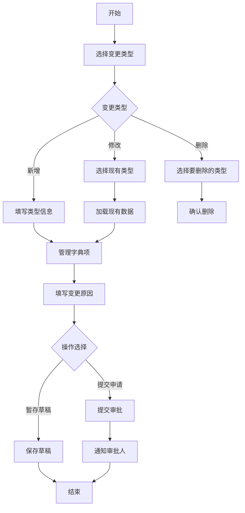
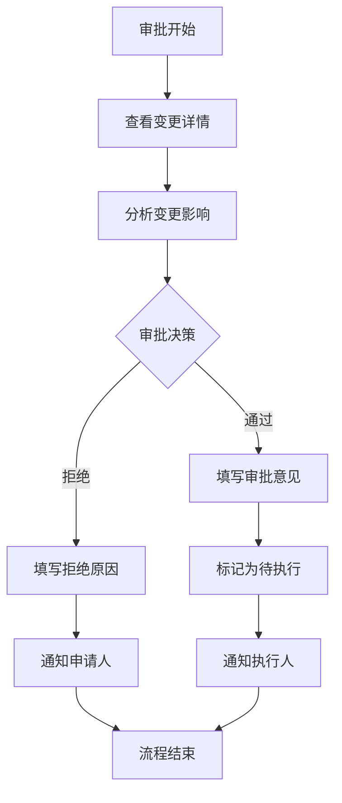
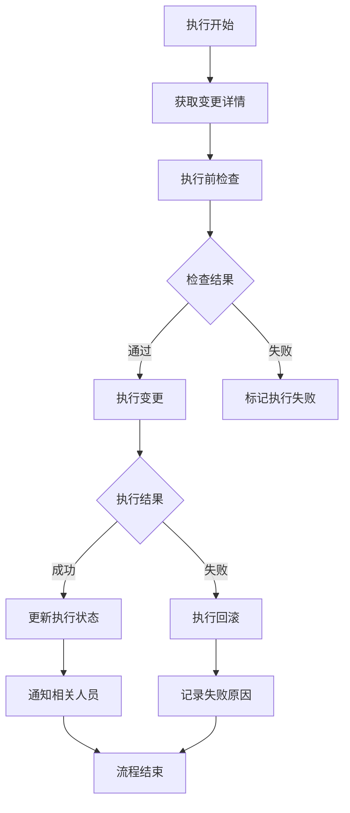

## 原始需求
- 系统中有业务数据字典表biz_ddct_item、biz_ddct_type，需要日常团队不同的人进行变更，变更涉及增删改
- 需求是让开发填写变更表，之后提交存一个记录，不是流程记录，是变更记录
- 审批人员能看见原始的与要变更的，在同一个页面，方便审核
- 前端页面如何设计举例说明，后端逻辑怎么设计，包含哪些API,以及数据库表有哪些，怎么设计，变更表应该有哪些字段，主要变更的字段为 biz_ddct_item中的 DCT_SEQ，DCT_GRP，DCT_KEY、DCT_VAL_NM、DCT_TP_NM、DCT_VAL、DCT_TP、DCT_DSC提供原始字典表

## 一、需求文档

### 1.1 功能概述

#### 1.1.1 功能背景
随着系统规模扩大，数据字典管理日益复杂，需要团队协作进行字典变更。目前变更流程不规范，缺乏审批机制，变更记录不完整，存在数据不一致风险。为此，需要建立标准化的数据字典变更管理系统。

#### 1.1.2 功能目标
1. 实现数据字典类型维度的标准化变更流程
2. 提供可视化变更对比和审批功能
3. 确保变更记录完整可追溯
4. 支持团队协作和权限控制
5. 提高数据字典管理的效率和安全性

### 1.2 业务需求

#### 1.2.1 用户角色
| 角色 | 职责 | 权限 |
|------|------|------|
| 开发人员 | 提交字典变更申请 | 提交申请、查看历史 |
| 审批人员 | 审批变更申请 | 审批操作、查看所有记录 |
| 系统管理员 | 执行变更、系统维护 | 所有权限 |
| 普通用户 | 使用字典数据 | 只读权限 |

#### 1.2.2 功能需求
1. **变更申请功能**
   - 支持新增、修改、删除字典类性
   - 支持草稿保存

2. **审批功能**
   - 可视化变更对比（原始值 vs 变更值）

3. **变更执行功能**
   - 手动执行变更
   - 事务性保证
   - 失败回滚机制

### 1.3 业务流程

#### 1.3.1 变更申请流程


#### 1.3.2 审批流程


#### 1.3.3 变更执行流程


### 1.4 数据需求

#### 1.4.1 数据实体
1. **字典类型（biz_ddct_type）**
2. **字典项（biz_ddct_item）**
3. **变更主记录（biz_ddct_type_change）**
4. **变更明细记录（biz_ddct_item_change）**


## 二、详细设计说明书

### 2.1 系统架构设计

#### 2.1.1 技术栈
- **前端**：Vue 2.7 + Element Plus + JavaScript
- **后端**：Spring Boot 2.7 + MyBatis Plus + MySQL 8.0
- **数据库**：MySQL 8.0 

#### 2.1.2 架构图
依据现有的

### 2.2 数据库详细设计

#### 2.2.1 表结构设计

**1. 字典类型变更主表（biz_ddct_type_change）**
```sql
```

**2. 字典项变更明细表（biz_ddct_item_change）
```sql
```


### 2.3 核心类设计

#### 2.3.1 领域模型类

```java
// 1. 字典类型变更聚合根
public class DictTypeChangeAggregate {
    private String id;
    private DictTypeChange mainChange;          // 主变更信息
    private List<DictItemChange> itemChanges;   // 字典项变更列表
    private ApprovalFlow approvalFlow;          // 审批流程
    private OperationLog operationLog;          // 操作日志
    
    // 领域方法
    public void submitChange() {
        validateChange();
        generateChangeNo();
        calculateStatistics();
        changeStatusToPending();
        recordOperationLog("提交变更申请");
    }
    
    public void approve(String approver, String comment) {
        validateApprovable();
        approvalFlow.approve(approver, comment);
        if (approvalFlow.isFullyApproved()) {
            changeStatusToApproved();
        }
        recordOperationLog("审批通过");
    }
    
    public void execute() {
        validateExecutable();
        try {
            executeDictTypeChange();
            executeDictItemChanges();
            changeStatusToExecuted();
            recordOperationLog("执行成功");
        } catch (Exception e) {
            rollbackChanges();
            changeStatusToFailed();
            recordOperationLog("执行失败: " + e.getMessage());
            throw e;
        }
    }
    
    private void executeDictTypeChange() {
        // 伪代码：执行字典类型变更
        switch (mainChange.getChangeType()) {
            case ADD:
                dictTypeRepository.insert(convertToDictType(mainChange));
                break;
            case MOD:
                DictType existing = dictTypeRepository.findById(mainChange.getDictTypeId());
                updateDictType(existing, mainChange);
                dictTypeRepository.update(existing);
                break;
            case DEL:
                dictTypeRepository.logicalDelete(mainChange.getDictTypeId());
                break;
        }
    }
    
    private void executeDictItemChanges() {
        // 分批执行，防止内存溢出
        int batchSize = 100;
        List<List<DictItemChange>> batches = ListUtils.partition(itemChanges, batchSize);
        
        for (List<DictItemChange> batch : batches) {
            executeBatchItems(batch);
        }
    }
    
    private void executeBatchItems(List<DictItemChange> batch) {
        for (DictItemChange item : batch) {
            try {
                executeSingleItem(item);
                item.markAsSuccess();
            } catch (Exception e) {
                item.markAsFailed(e.getMessage());
                throw new BusinessException("字典项执行失败", e);
            }
        }
    }
}

// 2. 字典项变更值对象
public class DictItemChange {
    private String id;
    private String changeId;
    private String dictId;
    private ChangeOperation operation;
    private DictItemData oldData;
    private DictItemData newData;
    private ExecuteStatus executeStatus;
    
    // 执行方法
    public void execute(DictItemRepository repository) {
        switch (operation) {
            case ADD:
                repository.insert(convertToDictItem(newData));
                break;
            case MOD:
                DictItem existing = repository.findById(dictId);
                updateDictItem(existing, newData);
                repository.update(existing);
                break;
            case DEL:
                repository.logicalDelete(dictId);
                break;
        }
    }
}

// 3. 字典项数据值对象
public class DictItemData {
    private Integer dctSeq;
    private String dctGrp;
    private String dctKey;
    private String dctValNm;
    private String dctVal;
    private String dctDsc;
    private String stcd;
    
    // 验证方法
    public void validate() {
        if (StringUtils.isBlank(dctKey)) {
            throw new ValidationException("字典键不能为空");
        }
        if (StringUtils.isBlank(dctValNm)) {
            throw new ValidationException("字典值名称不能为空");
        }
        if (StringUtils.isBlank(dctVal)) {
            throw new ValidationException("字典值不能为空");
        }
        if (dctSeq == null) {
            throw new ValidationException("排序号不能为空");
        }
    }
}
```

#### 2.3.2 服务类设计

```java
// 1. 变更申请服务
@Service
@Slf4j
public class DictChangeApplyService {
    
    @Autowired
    private DictTypeChangeRepository changeRepository;
    
    @Autowired
    private DictTypeRepository dictTypeRepository;
    
    @Autowired
    private NotificationService notificationService;
    
    @Transactional(rollbackFor = Exception.class)
    public DictTypeChangeVO applyChange(DictChangeApplyDTO dto) {
        // 1. 参数验证
        ValidationUtils.validate(dto);
        
        // 2. 构建变更聚合根
        DictTypeChangeAggregate aggregate = buildChangeAggregate(dto);
        
        // 3. 提交变更
        aggregate.submitChange();
        
        // 4. 保存到数据库
        saveChangeAggregate(aggregate);
        
        // 5. 发送飞秋通知
        sendNotification(aggregate);
        
        // 6. 返回结果
        return convertToVO(aggregate);
    }
    
    private DictTypeChangeAggregate buildChangeAggregate(DictChangeApplyDTO dto) {
        DictTypeChangeAggregate aggregate = new DictTypeChangeAggregate();
        
        // 构建主变更
        DictTypeChange mainChange = new DictTypeChange();
        BeanUtils.copyProperties(dto.getTypeChange(), mainChange);
        mainChange.setChangeType(dto.getChangeType());
        mainChange.setApplyUser(getCurrentUser());
        mainChange.setApplyTime(new Date());
        
        // 构建字典项变更
        List<DictItemChange> itemChanges = new ArrayList<>();
        for (DictItemChangeDTO itemDto : dto.getItemChanges()) {
            DictItemChange itemChange = buildItemChange(itemDto);
            itemChanges.add(itemChange);
        }
        
        // 构建审批流程
        ApprovalFlow approvalFlow = buildApprovalFlow(dto);
        
        aggregate.setMainChange(mainChange);
        aggregate.setItemChanges(itemChanges);
        aggregate.setApprovalFlow(approvalFlow);
        
        return aggregate;
    }
    
    private void sendNotification(DictTypeChangeAggregate aggregate) {
        NotificationMessage message = new NotificationMessage();
        message.setTitle("字典类型变更申请通知");
        message.setContent(String.format(
            "【%s】提交了字典类型变更申请，单号：%s",
            aggregate.getMainChange().getApplyUser(),
            aggregate.getMainChange().getChangeNo()
        ));
        message.setRecipients(getApprovers());
        message.setLink("/dict-change/approve/" + aggregate.getId());
        
        notificationService.send(message);
    }
}

// 2. 变更审批服务
@Service
public class DictChangeApproveService {
    
    @Transactional(rollbackFor = Exception.class)
    public void approveChange(String changeId, ApproveDTO dto) {
        // 1. 获取变更聚合根
        DictTypeChangeAggregate aggregate = loadAggregate(changeId);
        
        // 2. 验证审批权限
        validateApprovePermission(aggregate);
        
        // 3. 执行审批
        aggregate.approve(getCurrentUser(), dto.getApproveRemark());
        
        // 4. 更新状态
        updateAggregate(aggregate);
        
        // 5. 发送通知
        if (aggregate.isApproved()) {
            notifyExecutors(aggregate);
        } else if (aggregate.isRejected()) {
            notifyApplicant(aggregate);
        }
    }
    
    private void validateApprovePermission(DictTypeChangeAggregate aggregate) {
        String currentUser = getCurrentUser();
        List<String> approvers = getApproversForChange(aggregate);
        
        if (!approvers.contains(currentUser)) {
            throw new PermissionDeniedException("无权审批此变更");
        }
        
        if (!aggregate.isPendingApprove()) {
            throw new BusinessException("当前状态不可审批");
        }
    }
}

// 3. 变更执行服务
@Service
public class DictChangeExecuteService {
    
    @Autowired
    private DictTypeRepository dictTypeRepository;
    
    @Autowired
    private DictItemRepository dictItemRepository;
    
    @Autowired
    private TransactionTemplate transactionTemplate;
    
    @Transactional(rollbackFor = Exception.class)
    public ExecuteResultVO executeChange(String changeId) {
        // 1. 获取变更聚合根
        DictTypeChangeAggregate aggregate = loadAggregate(changeId);
        
        // 2. 验证执行条件
        validateExecuteCondition(aggregate);
        
        // 3. 执行变更（在独立事务中）
        ExecuteResultVO result = transactionTemplate.execute(status -> {
            try {
                aggregate.execute();
                return ExecuteResultVO.success();
            } catch (Exception e) {
                status.setRollbackOnly();
                return ExecuteResultVO.fail(e.getMessage());
            }
        });
        
        // 4. 更新执行结果
        updateExecuteResult(aggregate, result);
        
        return result;
    }
    
    private void validateExecuteCondition(DictTypeChangeAggregate aggregate) {
        if (!aggregate.isApproved()) {
            throw new BusinessException("未审批通过，不可执行");
        }
        
        if (aggregate.isExecuted()) {
            throw new BusinessException("已执行，不可重复执行");
        }
        
        // 检查字典类型是否存在冲突
        if (aggregate.getMainChange().getChangeType() == ChangeType.ADD) {
            checkDictTypeConflict(aggregate);
        }
        
        // 检查字典项是否存在冲突
        checkDictItemConflicts(aggregate);
    }
}

// 4. 变更查询服务
@Service
public class DictChangeQueryService {
    
    public PageResult<DictChangeVO> queryChanges(ChangeQueryDTO queryDTO) {
        // 1. 构建查询条件
        QueryWrapper<DictTypeChange> wrapper = buildQueryWrapper(queryDTO);
        
        // 2. 分页查询主记录
        Page<DictTypeChange> page = changeRepository.selectPage(
            new Page<>(queryDTO.getPage(), queryDTO.getSize()),
            wrapper
        );
        
        // 3. 批量加载关联数据
        List<String> changeIds = page.getRecords().stream()
            .map(DictTypeChange::getId)
            .collect(Collectors.toList());
        
        Map<String, List<DictItemChange>> itemChangesMap = 
            loadItemChangesByChangeIds(changeIds);
        
        Map<String, ApprovalFlow> approvalFlowMap = 
            loadApprovalFlowsByChangeIds(changeIds);
        
        // 4. 组装结果
        List<DictChangeVO> vos = page.getRecords().stream()
            .map(change -> {
                DictChangeVO vo = convertToVO(change);
                vo.setItemChanges(itemChangesMap.get(change.getId()));
                vo.setApprovalFlow(approvalFlowMap.get(change.getId()));
                return vo;
            })
            .collect(Collectors.toList());
        
        return PageResult.of(vos, page.getTotal());
    }
    
    public ChangeDetailVO getChangeDetail(String changeId) {
        // 1. 获取主变更
        DictTypeChange change = changeRepository.selectById(changeId);
        if (change == null) {
            throw new NotFoundException("变更记录不存在");
        }
        
        // 2. 获取字典项变更
        List<DictItemChange> itemChanges = itemChangeRepository
            .selectByChangeId(changeId);
        
        // 3. 获取审批流程
        ApprovalFlow approvalFlow = approvalFlowRepository
            .selectByBizId(changeId);
        
        // 4. 获取操作日志
        List<OperationLog> operationLogs = operationLogRepository
            .selectByBizId(changeId);
        
        // 5. 组装详情
        ChangeDetailVO detail = new ChangeDetailVO();
        detail.setChangeInfo(change);
        detail.setItemChanges(itemChanges);
        detail.setApprovalFlow(approvalFlow);
        detail.setOperationLogs(operationLogs);
        detail.setChangeImpact(analyzeImpact(change, itemChanges));
        
        return detail;
    }
}
```

#### 2.3.3 控制器类设计

```java
@RestController
@RequestMapping("/api/dict-change")
@Api(tags = "数据字典变更管理")
public class DictChangeController {
    
    @Autowired
    private DictChangeApplyService applyService;
    
    @Autowired
    private DictChangeApproveService approveService;
    
    @Autowired
    private DictChangeExecuteService executeService;
    
    @Autowired
    private DictChangeQueryService queryService;
    
    @PostMapping("/apply")
    @ApiOperation("提交变更申请")
    @PreAuthorize("hasPermission('dict:type:change:apply')")
    public Result<DictTypeChangeVO> applyChange(@Valid @RequestBody DictChangeApplyDTO dto) {
        DictTypeChangeVO result = applyService.applyChange(dto);
        return Result.success(result);
    }
    
    @PostMapping("/approve/{changeId}")
    @ApiOperation("审批变更")
    @PreAuthorize("hasPermission('dict:type:change:approve')")
    public Result<Void> approveChange(
            @PathVariable String changeId,
            @Valid @RequestBody ApproveDTO dto) {
        approveService.approveChange(changeId, dto);
        return Result.success();
    }
    
    @PostMapping("/execute/{changeId}")
    @ApiOperation("执行变更")
    @PreAuthorize("hasPermission('dict:type:change:execute')")
    public Result<ExecuteResultVO> executeChange(@PathVariable String changeId) {
        ExecuteResultVO result = executeService.executeChange(changeId);
        return Result.success(result);
    }
    
    @GetMapping("/detail/{changeId}")
    @ApiOperation("获取变更详情")
    @PreAuthorize("hasPermission('dict:type:change:view')")
    public Result<ChangeDetailVO> getChangeDetail(@PathVariable String changeId) {
        ChangeDetailVO detail = queryService.getChangeDetail(changeId);
        return Result.success(detail);
    }
    
    @GetMapping("/list")
    @ApiOperation("查询变更记录")
    @PreAuthorize("hasPermission('dict:type:change:view')")
    public Result<PageResult<DictChangeVO>> queryChanges(ChangeQueryDTO queryDTO) {
        PageResult<DictChangeVO> result = queryService.queryChanges(queryDTO);
        return Result.success(result);
    }
    
    @PostMapping("/items/import")
    @ApiOperation("导入字典项")
    @PreAuthorize("hasPermission('dict:type:change:apply')")
    public Result<List<DictItemImportVO>> importDictItems(
            @RequestParam("file") MultipartFile file,
            @RequestParam(value = "dictType", required = false) String dictType) {
        List<DictItemImportVO> result = importService.importDictItems(file, dictType);
        return Result.success(result);
    }
    
    @GetMapping("/export")
    @ApiOperation("导出变更记录")
    @PreAuthorize("hasPermission('dict:type:change:view')")
    public void exportChanges(ChangeQueryDTO queryDTO, HttpServletResponse response) {
        exportService.exportChanges(queryDTO, response);
    }
}

// DTO类示例
@Data
@ApiModel("变更申请DTO")
public class DictChangeApplyDTO {
    
    @ApiModelProperty(value = "变更类型", required = true)
    @NotNull(message = "变更类型不能为空")
    private ChangeType changeType;
    
    @ApiModelProperty(value = "字典类型ID", notes = "修改/删除时必填")
    private String dictTypeId;
    
    @ApiModelProperty(value = "字典类型变更信息")
    @Valid
    private DictTypeChangeDTO typeChange;
    
    @ApiModelProperty(value = "字典项变更列表")
    @Valid
    @Size(max = 1000, message = "字典项变更数量不能超过1000")
    private List<DictItemChangeDTO> itemChanges;
    
    @ApiModelProperty(value = "变更原因", required = true)
    @NotBlank(message = "变更原因不能为空")
    @Size(max = 500, message = "变更原因长度不能超过500字符")
    private String changeReason;
    
    @ApiModelProperty(value = "变更影响")
    @Size(max = 1000, message = "变更影响长度不能超过1000字符")
    private String changeImpact;
}

@Data
@ApiModel("字典项变更DTO")
public class DictItemChangeDTO {
    
    @ApiModelProperty(value = "操作类型", required = true)
    @NotNull(message = "操作类型不能为空")
    private ChangeOperation operation;
    
    @ApiModelProperty(value = "字典项ID", notes = "修改/删除时必填")
    private String dictId;
    
    @ApiModelProperty(value = "原始数据", notes = "修改时可选，删除时自动加载")
    private DictItemDataDTO oldData;
    
    @ApiModelProperty(value = "新数据", notes = "新增/修改时必填")
    @Valid
    private DictItemDataDTO newData;
}
```


## 三、开发详细步骤

#### 3.1.2 功能初始化

**1. 后端项目结构**
使用当前项目结构

**2. 前端项目结构**
### 3.2 数据库开发

#### 3.2.1 创建数据库脚本

```sql
-- 1. 创建字典类型变更主表
CREATE TABLE `biz_ddct_type_change` (
    -- 字段定义请设计
)ENGINE=InnoDB DEFAULT CHARSET=utf8mb4 COLLATE=utf8mb4_0900_ai_ci COMMENT='字典类型变更主表';

-- 2. 创建字典项变更明细表
CREATE TABLE `biz_ddct_item_change` (
    -- 字段定义见上文
) ENGINE=InnoDB DEFAULT CHARSET=utf8mb4 COLLATE=utf8mb4_0900_ai_ci COMMENT='字典项变更明细表';

-- 3. 创建操作日志表（已有，sys_operation_log）
-- 4. 创建审批流程表（已有，biz_approval_flow）
-- 5. 创建字典类型表（已有，biz_ddct_type）
-- 6. 创建字典项表（已有，biz_ddct_item）

```

### 3.3 后端开发步骤

#### 步骤1：创建实体类

```java
// 1. 字典类型变更实体
@Data
@TableName("biz_ddct_type_change")
@ApiModel("字典类型变更实体")
public class DictTypeChange {
    
    @TableId(type = IdType.ASSIGN_ID)
    @ApiModelProperty("主键ID")
    private String id;
    
    @ApiModelProperty("变更单号")
    private String changeNo;
    
    @ApiModelProperty("关联字典类型ID")
    private String dctTpId;
    
    @ApiModelProperty("变更类型")
    private ChangeType changeType;
    
    @ApiModelProperty("原始字典类型编码")
    private String oldDctTp;
    
    @ApiModelProperty("新字典类型编码")
    private String newDctTp;
    
    @ApiModelProperty("原始字典类型名称")
    private String oldDctTpNm;
    
    @ApiModelProperty("新字典类型名称")
    private String newDctTpNm;
    
    @ApiModelProperty("申请人")
    private String applyUser;
    
    @ApiModelProperty("申请时间")
    private Date applyTime;
    
    @ApiModelProperty("审批状态")
    private ApproveStatus approveStatus;
    
    @ApiModelProperty("执行状态")
    private ExecuteStatus executeStatus;
    
    @ApiModelProperty("创建时间")
    private Date createTime;
    
    @ApiModelProperty("更新时间")
    private Date updateTime;
    
    @TableField(exist = false)
    @ApiModelProperty("字典项变更列表")
    private List<DictItemChange> itemChanges;
    
    @TableField(exist = false)
    @ApiModelProperty("审批流程")
    private ApprovalFlow approvalFlow;
}

// 2. 字典项变更实体
@Data
@TableName("biz_ddct_item_change")
@ApiModel("字典项变更实体")
public class DictItemChange {
    
    @TableId(type = IdType.ASSIGN_ID)
    @ApiModelProperty("主键ID")
    private String id;
    
    @ApiModelProperty("关联变更主表ID")
    private String changeId;
    
    @ApiModelProperty("操作类型")
    private ChangeOperation changeOperation;
    
    @ApiModelProperty("原始字典键")
    private String oldDctKey;
    
    @ApiModelProperty("新字典键")
    private String newDctKey;
    
    @ApiModelProperty("执行状态")
    private ExecuteStatus executeStatus;
    
    @ApiModelProperty("执行结果")
    private String executeResult;
    
    @ApiModelProperty("创建时间")
    private Date createTime;
}
```

#### 步骤2：创建Mapper接口

```java
// 1. 字典类型变更Mapper
@Mapper
public interface DictTypeChangeMapper extends BaseMapper<DictTypeChange> {
    
    /**
     * 分页查询变更记录
     */
    @Select("<script>" +
            "SELECT * FROM biz_ddct_type_change " +
            "<where>" +
            "   <if test='query.changeNo != null and query.changeNo != \"\"'>" +
            "       AND change_no LIKE CONCAT('%', #{query.changeNo}, '%')" +
            "   </if>" +
            "   <if test='query.dictType != null and query.dictType != \"\"'>" +
            "       AND (old_dct_tp = #{query.dictType} OR new_dct_tp = #{query.dictType})" +
            "   </if>" +
            "   <if test='query.approveStatus != null and query.approveStatus != \"\"'>" +
            "       AND approve_status = #{query.approveStatus}" +
            "   </if>" +
            "   <if test='query.startApplyTime != null'>" +
            "       AND apply_time >= #{query.startApplyTime}" +
            "   </if>" +
            "   <if test='query.endApplyTime != null'>" +
            "       AND apply_time &lt;= #{query.endApplyTime}" +
            "   </if>" +
            "</where>" +
            " ORDER BY apply_time DESC" +
            "</script>")
    List<DictTypeChange> selectByPage(@Param("query") ChangeQueryDTO query);
    
    /**
     * 获取待审批的变更列表
     */
    @Select("SELECT * FROM biz_ddct_type_change " +
            "WHERE approve_status = 'PENDING' " +
            "ORDER BY apply_time ASC")
    List<DictTypeChange> selectPendingApproval();
    
    /**
     * 获取待执行的变更列表
     */
    @Select("SELECT * FROM biz_ddct_type_change " +
            "WHERE approve_status = 'APPROVED' " +
            "AND execute_status = 'PENDING' " +
            "ORDER BY approve_time ASC")
    List<DictTypeChange> selectPendingExecute();
}

// 2. 字典项变更Mapper
@Mapper
public interface DictItemChangeMapper extends BaseMapper<DictItemChange> {
    
    /**
     * 批量插入字典项变更
     */
    @Insert("<script>" +
            "INSERT INTO biz_ddct_item_change " +
            "(id, change_id, change_operation, old_dct_key, new_dct_key, " +
            "old_dct_val_nm, new_dct_val_nm, old_dct_val, new_dct_val, " +
            "execute_status, create_time) VALUES " +
            "<foreach collection='list' item='item' separator=','>" +
            "(#{item.id}, #{item.changeId}, #{item.changeOperation}, " +
            "#{item.oldDctKey}, #{item.newDctKey}, #{item.oldDctValNm}, " +
            "#{item.newDctValNm}, #{item.oldDctVal}, #{item.newDctVal}, " +
            "#{item.executeStatus}, #{item.createTime})" +
            "</foreach>" +
            "</script>")
    int batchInsert(@Param("list") List<DictItemChange> items);
    
    /**
     * 根据变更ID查询字典项变更
     */
    @Select("SELECT * FROM biz_ddct_item_change " +
            "WHERE change_id = #{changeId} " +
            "ORDER BY item_order ASC")
    List<DictItemChange> selectByChangeId(@Param("changeId") String changeId);
    
    /**
     * 批量更新执行状态
     */
    @Update("<script>" +
            "<foreach collection='list' item='item' separator=';'>" +
            "UPDATE biz_ddct_item_change SET " +
            "execute_status = #{item.executeStatus}, " +
            "execute_result = #{item.executeResult}, " +
            "update_time = #{item.updateTime} " +
            "WHERE id = #{item.id}" +
            "</foreach>" +
            "</script>")
    int batchUpdateExecuteStatus(@Param("list") List<DictItemChange> items);
}
```

#### 步骤3：创建Service接口和实现

```java
// 1. 变更申请Service接口
public interface DictChangeApplyService {
    
    /**
     * 提交变更申请
     */
    DictTypeChangeVO applyChange(DictChangeApplyDTO dto);
    
    /**
     * 保存草稿
     */
    DictTypeChangeVO saveDraft(DictChangeApplyDTO dto);
    
    /**
     * 导入字典项
     */
    List<DictItemImportVO> importDictItems(MultipartFile file, String dictType);
    
    /**
     * 验证变更申请
     */
    ValidationResult validateChange(DictChangeApplyDTO dto);
}

// 2. Service实现类
@Service
@Slf4j
public class DictChangeApplyServiceImpl implements DictChangeApplyService {
    
    @Autowired
    private DictTypeChangeMapper changeMapper;
    
    @Autowired
    private DictItemChangeMapper itemChangeMapper;
    
    @Autowired
    private DictTypeMapper dictTypeMapper;
    
    @Autowired
    private DictItemMapper dictItemMapper;
    
    @Autowired
    private ChangeNoGenerator changeNoGenerator;
    
    @Autowired
    private DictChangeValidator validator;
    
    @Override
    @Transactional(rollbackFor = Exception.class)
    public DictTypeChangeVO applyChange(DictChangeApplyDTO dto) {
        // 1. 验证参数
        ValidationResult validationResult = validator.validate(dto);
        if (!validationResult.isValid()) {
            throw new ValidationException(validationResult.getErrors());
        }
        
        // 2. 生成变更单号
        String changeNo = changeNoGenerator.generateChangeNo();
        
        // 3. 保存变更主记录
        DictTypeChange change = buildDictTypeChange(dto, changeNo);
        changeMapper.insert(change);
        
        // 4. 保存字典项变更
        if (CollectionUtils.isNotEmpty(dto.getItemChanges())) {
            List<DictItemChange> itemChanges = buildDictItemChanges(dto.getItemChanges(), change.getId());
            itemChangeMapper.batchInsert(itemChanges);
            
            // 更新统计信息
            updateChangeStatistics(change.getId());
        }
        
        // 5. 创建审批流程
        createApprovalFlow(change.getId());
        
        // 6. 记录操作日志
        logOperation(change, "提交变更申请");
        
        // 7. 发送通知
        sendApplyNotification(change);
        
        return convertToVO(change);
    }
    
    private DictTypeChange buildDictTypeChange(DictChangeApplyDTO dto, String changeNo) {
        DictTypeChange change = new DictTypeChange();
        BeanUtils.copyProperties(dto.getTypeChange(), change);
        
        change.setId(IdUtil.fastUUID());
        change.setChangeNo(changeNo);
        change.setChangeType(dto.getChangeType());
        change.setApplyUser(SecurityUtils.getCurrentUserId());
        change.setApplyTime(new Date());
        change.setApproveStatus(ApproveStatus.PENDING);
        change.setExecuteStatus(ExecuteStatus.PENDING);
        change.setCreateTime(new Date());
        
        return change;
    }
    
    private List<DictItemChange> buildDictItemChanges(List<DictItemChangeDTO> itemDTOs, String changeId) {
        List<DictItemChange> items = new ArrayList<>();
        
        for (int i = 0; i < itemDTOs.size(); i++) {
            DictItemChangeDTO dto = itemDTOs.get(i);
            DictItemChange item = new DictItemChange();
            
            item.setId(IdUtil.fastUUID());
            item.setChangeId(changeId);
            item.setChangeOperation(dto.getOperation());
            item.setItemOrder(i);
            
            // 设置原始值
            if (dto.getOldData() != null) {
                BeanUtils.copyProperties(dto.getOldData(), item, "old");
            }
            
            // 设置新值
            if (dto.getNewData() != null) {
                BeanUtils.copyProperties(dto.getNewData(), item, "new");
            }
            
            item.setExecuteStatus(ExecuteStatus.PENDING);
            item.setCreateTime(new Date());
            
            items.add(item);
        }
        
        return items;
    }
    
    @Override
    public List<DictItemImportVO> importDictItems(MultipartFile file, String dictType) {
        try {
            // 1. 验证文件类型
            String fileName = file.getOriginalFilename();
            if (!StringUtils.endsWithIgnoreCase(fileName, ".xlsx") && 
                !StringUtils.endsWithIgnoreCase(fileName, ".xls")) {
                throw new ValidationException("只支持Excel文件");
            }
            
            // 2. 读取Excel
            List<DictItemImportDTO> importData = readExcelFile(file);
            
            // 3. 验证数据
            List<ValidationError> errors = validateImportData(importData, dictType);
            if (!errors.isEmpty()) {
                throw new ValidationException(errors);
            }
            
            // 4. 转换为导入结果
            return convertToImportVO(importData);
            
        } catch (IOException e) {
            throw new BusinessException("文件读取失败: " + e.getMessage());
        }
    }
    
    private List<DictItemImportDTO> readExcelFile(MultipartFile file) throws IOException {
        List<DictItemImportDTO> result = new ArrayList<>();
        
        try (Workbook workbook = WorkbookFactory.create(file.getInputStream())) {
            Sheet sheet = workbook.getSheetAt(0);
            
            for (int i = 1; i <= sheet.getLastRowNum(); i++) { // 跳过表头
                Row row = sheet.getRow(i);
                if (row == null) continue;
                
                DictItemImportDTO dto = new DictItemImportDTO();
                dto.setRowNum(i + 1);
                dto.setDctKey(getCellValue(row.getCell(0)));
                dto.setDctValNm(getCellValue(row.getCell(1)));
                dto.setDctVal(getCellValue(row.getCell(2)));
                dto.setDctDsc(getCellValue(row.getCell(3)));
                dto.setDctSeq(parseInt(getCellValue(row.getCell(4))));
                dto.setDctGrp(getCellValue(row.getCell(5)));
                dto.setStcd(getCellValue(row.getCell(6)));
                
                result.add(dto);
            }
        }
        
        return result;
    }
}
```

#### 步骤4：创建Controller

```java
@RestController
@RequestMapping("/api/dict/change")
@Api(tags = "数据字典变更管理")
@Slf4j
public class DictChangeController {
    
    @Autowired
    private DictChangeApplyService applyService;
    
    @Autowired
    private DictChangeApproveService approveService;
    
    @Autowired
    private DictChangeExecuteService executeService;
    
    @Autowired
    private DictChangeQueryService queryService;
    
    @PostMapping("/apply")
    @ApiOperation("提交变更申请")
    @PreAuthorize("@ss.hasPermi('dict:change:apply')")
    public Result<DictTypeChangeVO> applyChange(@Valid @RequestBody DictChangeApplyDTO dto) {
        log.info("收到变更申请: {}", JSON.toJSONString(dto));
        DictTypeChangeVO result = applyService.applyChange(dto);
        return Result.success("提交成功", result);
    }
    
    @PostMapping("/draft")
    @ApiOperation("保存草稿")
    @PreAuthorize("@ss.hasPermi('dict:change:apply')")
    public Result<DictTypeChangeVO> saveDraft(@Valid @RequestBody DictChangeApplyDTO dto) {
        DictTypeChangeVO result = applyService.saveDraft(dto);
        return Result.success("保存成功", result);
    }
    
    @PostMapping("/approve/{changeId}")
    @ApiOperation("审批变更")
    @PreAuthorize("@ss.hasPermi('dict:change:approve')")
    public Result<Void> approveChange(
            @PathVariable String changeId,
            @Valid @RequestBody ApproveDTO dto) {
        log.info("审批变更: changeId={}, approveResult={}", changeId, dto.getApproveResult());
        approveService.approveChange(changeId, dto);
        return Result.success("审批成功");
    }
    
    @PostMapping("/execute/{changeId}")
    @ApiOperation("执行变更")
    @PreAuthorize("@ss.hasPermi('dict:change:execute')")
    public Result<ExecuteResultVO> executeChange(@PathVariable String changeId) {
        log.info("执行变更: changeId={}", changeId);
        ExecuteResultVO result = executeService.executeChange(changeId);
        return Result.success("执行成功", result);
    }
    
    @GetMapping("/detail/{changeId}")
    @ApiOperation("获取变更详情")
    @PreAuthorize("@ss.hasPermi('dict:change:view')")
    public Result<ChangeDetailVO> getChangeDetail(@PathVariable String changeId) {
        ChangeDetailVO detail = queryService.getChangeDetail(changeId);
        return Result.success(detail);
    }
    
    @GetMapping("/list")
    @ApiOperation("查询变更记录")
    @PreAuthorize("@ss.hasPermi('dict:change:view')")
    public Result<PageResult<DictChangeVO>> queryChanges(ChangeQueryDTO queryDTO) {
        PageResult<DictChangeVO> result = queryService.queryChanges(queryDTO);
        return Result.success(result);
    }
    
    @PostMapping("/items/import")
    @ApiOperation("导入字典项")
    @PreAuthorize("@ss.hasPermi('dict:change:apply')")
    public Result<List<DictItemImportVO>> importDictItems(
            @RequestParam("file") MultipartFile file,
            @RequestParam(value = "dictType", required = false) String dictType) {
        List<DictItemImportVO> result = applyService.importDictItems(file, dictType);
        return Result.success("导入成功", result);
    }
    
    @GetMapping("/export")
    @ApiOperation("导出变更记录")
    @PreAuthorize("@ss.hasPermi('dict:change:view')")
    public void exportChanges(ChangeQueryDTO queryDTO, HttpServletResponse response) {
        queryService.exportChanges(queryDTO, response);
    }
    
    @GetMapping("/pending/approve")
    @ApiOperation("获取待审批列表")
    @PreAuthorize("@ss.hasPermi('dict:change:approve')")
    public Result<List<DictChangeVO>> getPendingApprove() {
        List<DictChangeVO> result = queryService.getPendingApprove();
        return Result.success(result);
    }
    
    @GetMapping("/pending/execute")
    @ApiOperation("获取待执行列表")
    @PreAuthorize("@ss.hasPermi('dict:change:execute')")
    public Result<List<DictChangeVO>> getPendingExecute() {
        List<DictChangeVO> result = queryService.getPendingExecute();
        return Result.success(result);
    }
}
```


```Java
**工具类：IdUtil.java**
```java
public class IdUtil {
    
    private static final Snowflake SNOWFLAKE = new Snowflake();
    
    public static String fastUUID() {
        return UUID.randomUUID().toString().replace("-", "");
    }
    
    public static String snowflakeId() {
        return String.valueOf(SNOWFLAKE.nextId());
    }
    
    public static String generateId() {
        return fastUUID();
    }
}
```

### 3.4 前端开发步骤


#### 步骤4：组件开发


#### 步骤5：页面开发

### 代码规范

#### 4.2.1 命名规范
1. **Java命名规范**
   - 类名：大驼峰，如 `DictTypeChangeService`
   - 方法名：小驼峰，如 `applyChange`
   - 变量名：小驼峰，如 `dictTypeList`
   - 常量：全大写+下划线，如 `MAX_ITEM_COUNT`

2. **数据库命名规范**
   - 表名：小写+下划线，如 `biz_ddct_type_change`
   - 字段名：小写+下划线，如 `change_no`

3. **前端命名规范**
   - Vue组件：大驼峰，如 `DictItemTable.vue`
   - 变量/函数：小驼峰，如 `itemList`
   - 常量：全大写+下划线，如 `API_TIMEOUT`

#### 4.2.2 代码质量要求
1. **代码注释**
   - 类注释：说明类的作用、作者、创建时间
   - 方法注释：说明方法功能、参数、返回值、异常
   - 复杂逻辑注释：说明算法思路

2. **代码规范检查**
   - 使用 CheckStyle 检查Java代码规范
   - 使用 ESLint 检查前端代码规范
   - 使用 SonarQube 进行代码质量分析

### 4.3 测试规范

#### 4.3.1 单元测试

## 五、总结

本技术文档提供了完整的数据字典类型维度变更管理系统的设计和实现方案，包括：

1. **需求分析**：明确了业务需求、用户角色和业务流程
2. **详细设计**：提供了系统架构、数据库设计、核心类设计和关键算法
3. **开发步骤**：给出了前后端具体的实现代码和配置
4. **研发规范**：制定了标准的研发流程和规范

该方案具有以下特点：
- **完整性**：覆盖了从需求到部署的全流程
- **可操作性**：提供了具体的代码示例和配置
- **可扩展性**：设计了清晰的架构和接口
- **规范性**：遵循了标准的研发流程

开发团队可以按照本文档的指导进行系统开发，确保项目按时、按质完成。