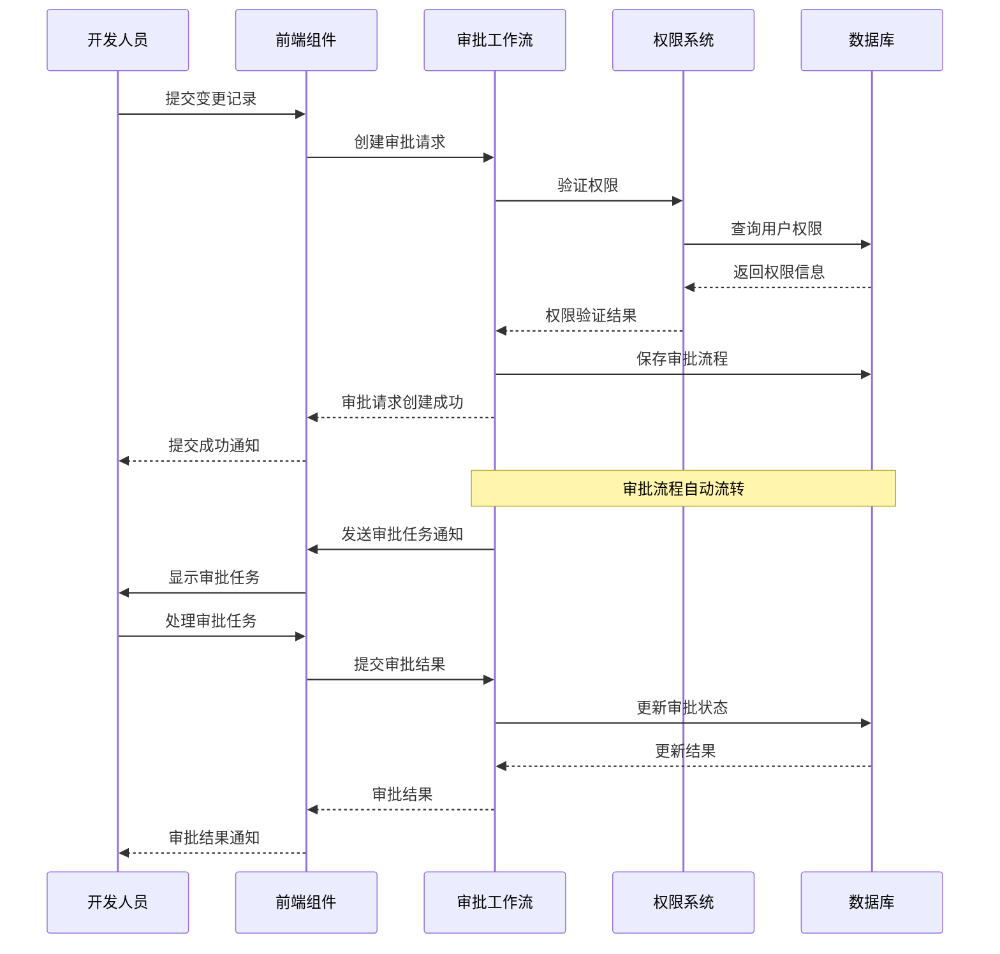
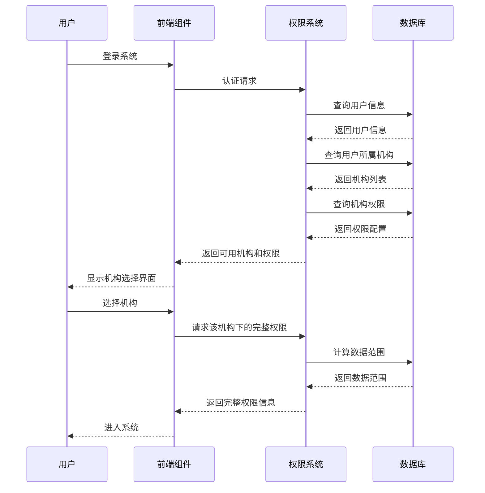

# 跨模块内容整合文档

## 1. 系统架构整体视图

平台采用分层架构设计，包含前端展示层、后端服务层、数据持久层和基础设施层。各模块之间通过明确的接口进行通信，形成完整的系统生态：

### 1.1 分层架构

| 层级 | 主要模块 | 核心功能 |
|------|----------|----------|
| 前端展示层 | 前端组件模块 | 用户界面展示、交互处理、数据可视化 |
| 后端服务层 | 权限系统模块、审批工作流模块 | 业务逻辑处理、权限控制、流程管理 |
| 数据持久层 | 数据库与实体模块 | 数据存储、数据访问、实体管理 |
| 基础设施层 | 系统架构模块 | 配置管理、日志记录、监控告警 |

### 1.2 模块依赖关系

```
前端组件模块
  ↑
  | 依赖API调用
  ↓
权限系统模块 ←→ 审批工作流模块
  ↑         ←→
  | 依赖数据访问
  ↓
数据库与实体模块
  ↑
  | 依赖系统架构
  ↓
系统架构模块
```

## 2. 跨模块数据流转

### 2.1 登录与权限验证流程

1. **用户登录**：
   - 前端组件模块发送登录请求
   - 权限系统模块验证用户身份
   - 返回临时token和可用机构列表

2. **机构选择与权限获取**：
   - 前端组件模块选择机构
   - 权限系统模块计算用户在该机构下的数据范围
   - 返回完整权限信息

3. **权限缓存与使用**：
   - 前端组件模块缓存权限信息
   - 在后续请求中携带权限信息
   - 后端服务层验证权限

### 2.2 审批工作流数据流转

1. **审批请求创建**：
   - 前端组件模块提交审批请求
   - 审批工作流模块创建审批流程
   - 数据库与实体模块存储审批数据

2. **审批任务分配**：
   - 审批工作流模块根据权限系统模块的配置分配审批任务
   - 通知相关审批人

3. **审批任务处理**：
   - 审批人通过前端组件模块处理审批任务
   - 审批工作流模块更新审批状态
   - 触发后续流程节点

4. **审批结果通知**：
   - 审批工作流模块通知相关人员
   - 更新业务对象状态

### 2.3 数据字典同步流程

1. **字典项变更**：
   - 管理员通过前端组件模块修改字典项
   - 数据库与实体模块更新字典数据
   - 触发字典变更事件

2. **字典变更通知**：
   - 系统架构模块发布字典变更事件
   - 各模块监听并更新本地缓存
   - 前端组件模块刷新字典数据

## 3. 核心业务流程

### 3.1 变更记录审批流程



### 3.2 多机构权限控制流程



## 4. 跨模块最佳实践

### 4.1 权限设计最佳实践

1. **最小权限原则**：
   - 为用户分配完成工作所需的最小权限
   - 基于角色的权限管理，避免直接为用户分配权限
   - 定期审查和更新用户权限

2. **权限分层设计**：
   - 功能权限：控制用户可以访问的功能
   - 数据权限：控制用户可以访问的数据范围
   - 字段权限：控制用户可以查看或修改的字段
   - 时间权限：控制权限的有效时间

3. **多维度权限控制**：
   - 基于角色的权限控制
   - 基于机构的权限控制
   - 基于数据范围的权限控制
   - 基于业务规则的权限控制

### 4.2 审批流程设计最佳实践

1. **模块化流程设计**：
   - 将审批流程拆分为独立的模块
   - 支持不同业务类型的动态流程配置
   - 实现流程节点的复用和组合

2. **灵活的审批规则**：
   - 支持基于角色、部门、职位的审批人分配
   - 支持条件分支和并行审批
   - 支持审批任务的转办和委托

3. **完整的审批历史**：
   - 记录审批流程的完整历史
   - 支持审批轨迹查询
   - 实现审批操作的审计日志

### 4.3 数据库与实体设计最佳实践

1. **一致性设计**：
   - 确保实体类与数据库表结构完全匹配
   - 使用ORM框架简化数据访问
   - 实现数据校验和一致性检查

2. **性能优化**：
   - 合理设计索引
   - 优化查询语句
   - 实现数据缓存
   - 采用异步处理方式

3. **扩展性设计**：
   - 支持分库分表
   - 实现数据分片
   - 支持多租户架构

### 4.4 前端开发最佳实践

1. **组件化设计**：
   - 将页面拆分为可复用的组件
   - 实现组件的封装和复用
   - 支持组件的动态加载和卸载

2. **状态管理**：
   - 合理使用状态管理库
   - 实现状态的分层管理
   - 支持状态的持久化和恢复

3. **性能优化**：
   - 实现组件懒加载
   - 优化API调用
   - 实现数据缓存
   - 减少DOM操作

## 5. 跨模块问题与解决方案

### 5.1 权限数据不一致问题

**问题描述**：不同模块之间的权限数据不一致，导致权限检查结果不准确。

**解决方案**：
1. 实现统一的权限数据模型
2. 建立权限数据同步机制
3. 定期进行权限数据一致性检查
4. 实现权限变更的实时通知

### 5.2 审批流程与业务系统集成问题

**问题描述**：审批流程与业务系统集成不紧密，导致审批结果无法及时影响业务状态。

**解决方案**：
1. 实现审批流程与业务系统的事件驱动集成
2. 建立统一的业务对象状态管理
3. 实现审批结果的自动同步
4. 提供审批流程的回调机制

### 5.3 数据字典同步问题

**问题描述**：数据字典更新后，各模块未能及时同步，导致数据不一致。

**解决方案**：
1. 实现字典变更的事件通知机制
2. 建立字典缓存的自动刷新机制
3. 提供字典版本管理
4. 实现字典变更的审计日志

### 5.4 跨模块性能瓶颈

**问题描述**：跨模块调用导致系统性能下降，响应时间延长。

**解决方案**：
1. 优化跨模块接口设计
2. 实现数据缓存
3. 采用异步通信方式
4. 进行性能监控和瓶颈分析

## 6. 系统扩展性设计

### 6.1 模块扩展机制

1. **插件化设计**：
   - 支持模块的动态加载和卸载
   - 提供模块扩展点
   - 实现模块间的松耦合集成

2. **API网关**：
   - 统一管理API访问
   - 实现请求路由和负载均衡
   - 提供API监控和限流

3. **服务注册与发现**：
   - 实现服务的自动注册和发现
   - 支持服务的健康检查
   - 实现服务的动态扩容

### 6.2 业务扩展机制

1. **业务规则引擎**：
   - 实现动态业务规则配置
   - 支持规则的热更新
   - 提供规则编辑器

2. **动态表单**：
   - 支持表单的动态配置
   - 实现表单字段的灵活扩展
   - 支持表单验证规则的配置

3. **工作流引擎**：
   - 支持流程的动态定义
   - 实现流程节点的灵活配置
   - 支持流程的版本管理

## 7. 系统监控与运维

### 7.1 监控体系

1. **应用监控**：
   - 监控应用的运行状态
   - 收集应用的性能指标
   - 实现应用的健康检查

2. **业务监控**：
   - 监控核心业务流程
   - 收集业务指标
   - 实现业务异常告警

3. **日志管理**：
   - 统一日志格式
   - 实现日志的集中收集和分析
   - 提供日志查询和分析工具

### 7.2 运维体系

1. **自动化部署**：
   - 实现持续集成和持续部署
   - 支持环境的自动化搭建
   - 实现应用的自动扩容

2. **故障管理**：
   - 实现故障的自动检测和告警
   - 提供故障定位和诊断工具
   - 实现故障的自动恢复

3. **配置管理**：
   - 实现配置的集中管理
   - 支持配置的版本管理
   - 实现配置的动态更新

## 8. 总结

跨模块整合是系统设计和开发中的重要环节，它确保了系统各模块之间的协同工作和数据一致性。通过合理的架构设计、明确的接口定义和完善的集成机制，可以实现系统的高可用性、高性能和高扩展性。

本文档从系统架构整体视图、跨模块数据流转、核心业务流程、跨模块最佳实践、跨模块问题与解决方案、系统扩展性设计和系统监控与运维等方面，全面阐述了跨模块整合的设计原则和实现方法。

在实际系统开发中，需要根据具体业务需求和技术栈，灵活应用这些设计原则和实现方法，确保系统各模块之间的协同工作和数据一致性，为用户提供可靠、高效和易用的系统服务。